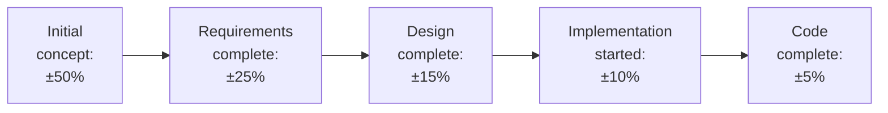

## Why Estimation Is Hard

"Software projects are always late." This stereotype exists because software is uniquely difficult to estimate. Unlike building a bridge (where you can calculate steel volumes), software complexity is hard to quantify before it is built.

**The planning paradox:** To plan a project, you need to know what will be built. But to know what will be built, you need to plan it. This circular dependency means all estimates are inherently uncertain — and that uncertainty must be acknowledged.

---

## What We Estimate

Three primary quantities:

| Quantity | What it means |
|---|---|
| **Size** | How big is the software? (lines of code, function points) |
| **Effort** | How many person-months are required? |
| **Duration** | How many calendar months will it take? |

Note: Effort ≠ Duration. Ten engineers working for 1 month = 10 person-months effort. But the duration is still 1 month (assuming no dependencies). However, adding engineers does not always shorten duration — "nine women cannot make a baby in one month" (Brooks, *The Mythical Man-Month*).

---

## Size Metrics

### Lines of Code (LOC)
The simplest size metric — count the lines of source code.

**Problems with LOC:**
- Language-dependent: 1000 LOC in Java ≠ 1000 LOC in Python (Python is more expressive)
- Can incentivise verbose code
- Cannot be counted before implementation (used for historical data, not estimation)

### Function Points (FP)
A language-independent size measure based on system **functionality** rather than code volume.

Function points count the functional elements of a system:

| Element | Description | Example |
|---|---|---|
| External Inputs | Unique user inputs | Login form, grade submission form |
| External Outputs | Reports and outputs | Grade transcript, payment receipt |
| External Enquiries | Query/response interactions | Check balance, search course |
| Internal Logic Files | Major data groups maintained | Student records, course catalogue |
| External Interface Files | Data shared with other systems | Payroll system integration |

Each element is weighted as simple, average, or complex, and the weights are summed to give raw function points. Adjustments are then applied for technical complexity.

**Why FP is better than LOC for estimation:**
- Can be counted from requirements (before coding)
- Language-independent
- Correlates with effort better than LOC for large systems

---

## Estimation Techniques

### Expert Judgment (Delphi Technique)
Ask experienced engineers to estimate independently, then aggregate their estimates. Repeat until consensus is reached.

**Delphi process:**
1. Experts estimate independently
2. Results shared anonymously
3. Experts see the distribution and revise
4. Repeat until convergence

**Advantages:** Captures implicit knowledge. Accounts for project-specific factors.  
**Disadvantages:** Subjective, susceptible to bias. Requires experienced estimators.

### Algorithmic Cost Models: COCOMO

**COCOMO (Constructive Cost Model)** uses a mathematical formula based on size to estimate effort and duration.

**Basic COCOMO formula:**

$$E = a \times S^b$$

$$T_D = c \times E^d$$

Where:
- $E$ = effort in person-months
- $S$ = size in thousands of lines of code (KLOC)
- $T_D$ = development time in months
- $a, b, c, d$ = constants depending on project type

**COCOMO project types:**

| Type | Description | $a$ | $b$ | $c$ | $d$ |
|---|---|---|---|---|---|
| Organic | Small team, familiar environment | 2.4 | 1.05 | 2.5 | 0.38 |
| Semi-detached | Mixed experience, mixed constraints | 3.0 | 1.12 | 2.5 | 0.35 |
| Embedded | Tight constraints, hardware interaction | 3.6 | 1.20 | 2.5 | 0.32 |

**Worked Example:**

A student portal project is estimated at 32 KLOC (32,000 lines of code). It is an organic project (small experienced team, familiar domain).

**Effort:**

$$E = 2.4 \times 32^{1.05} = 2.4 \times 35.7 \approx 85.7 \text{ person-months}$$

**Development time:**

$$T_D = 2.5 \times 85.7^{0.38} = 2.5 \times 6.1 \approx 15.2 \text{ months}$$

**Average team size:**

$$N = E / T_D = 85.7 / 15.2 \approx 5.6 \approx 6 \text{ people}$$

So: approximately 6 engineers for 15 months.

### Estimation by Analogy
Compare the new project to similar past projects. If Project A (which is similar) took 12 person-months, estimate Project B at approximately 12 person-months, adjusting for differences.

**Requires:** Historical data on past projects — this is why organisations should track their project metrics.

---

## The Estimation Funnel

Estimation accuracy improves as the project progresses:

Early estimates have large uncertainty — this is normal and should be communicated to stakeholders. Promising a precise estimate at project inception is dishonest.

---

## Brooks' Law

> "Adding manpower to a late software project makes it later." — Fred Brooks

Why? New engineers take time to get up to speed (onboarding). They require attention from existing team members (training). Communication overhead grows quadratically with team size: $n$ people require $n(n-1)/2$ communication channels.

**Implication:** Don't solve a late project by throwing more people at it.

---

## Key Takeaway

> Software estimation combines size metrics (LOC, function points), effort models (COCOMO), and expert judgment. All estimates carry uncertainty — which increases at earlier phases. COCOMO provides a formula: $E = a \times S^b$ for effort, $T_D = c \times E^d$ for duration. Function points are more reliable than LOC for early estimation. Brooks' law warns against adding people to a late project. Track historical project data to improve future estimates.

---

## Exam Tips

**What lecturers test:**
- Apply the Basic COCOMO formula with given values
- Explain function points — what are the five elements?
- Compare LOC and function points as size metrics
- State Brooks' Law and explain why it holds
- Describe the Delphi estimation technique

**Likely question:**
> "A software project is estimated at 20 KLOC. Using Basic COCOMO for an organic project ($a=2.4$, $b=1.05$, $c=2.5$, $d=0.38$), calculate the estimated effort and development time. Calculate the average team size." (10 marks)
