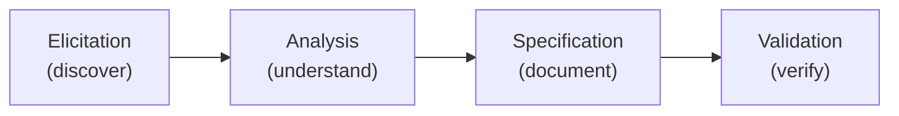
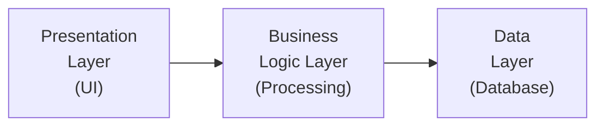
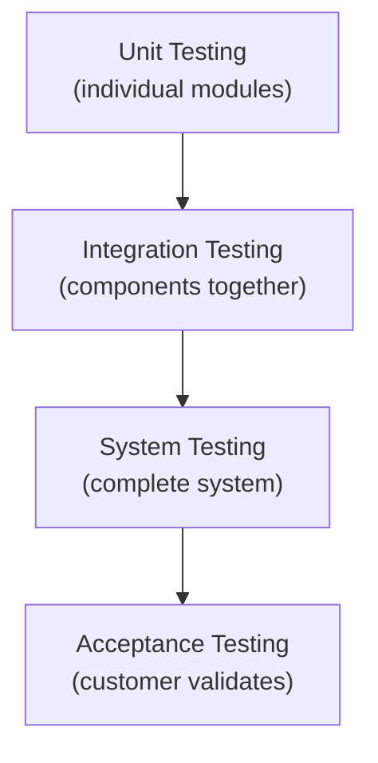
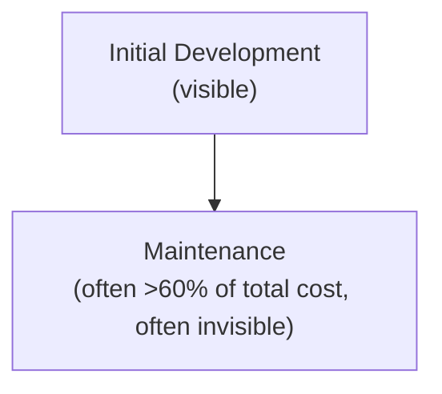
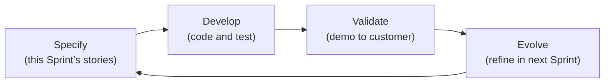

## The Four Activities in Detail

Every software process — Waterfall, Agile, Spiral — is composed of the same four fundamental activities, performed in different orders and with different emphases. Understanding what each activity involves is the foundation of software engineering practice.

---

## Activity 1: Software Specification (Requirements Engineering)

**Goal:** Establish what the system should do and what constraints it must satisfy.

This is where the most critical and most commonly mismanaged work happens. If requirements are wrong, everything built on them is wrong — no amount of perfect implementation can fix a misunderstood requirement.

### The Requirements Engineering Process

**Elicitation:** Discover requirements through interviews, workshops, observation, prototyping.

**Analysis:** Resolve conflicts, remove duplicates, prioritise, define system boundaries.

**Specification:** Document in the Software Requirements Specification (SRS).

**Validation:** Ensure requirements are correct, complete, consistent, and testable.

### Types of Requirements

| Type | Description | Example |
|---|---|---|
| **Functional** | What the system must do | "The system shall allow students to register for courses" |
| **Non-functional** | How the system performs | "The system shall respond within 2 seconds" |
| **Domain** | Rules from the application domain | "Banking: transactions must comply with CBN regulations" |

### Qualities of a Good Requirement

A good requirement is:
- **Correct** — reflects actual user needs
- **Complete** — covers all necessary detail
- **Consistent** — no contradictions
- **Verifiable** — can be tested
- **Traceable** — can be tracked throughout development

---

## Activity 2: Software Development (Design and Implementation)

**Goal:** Produce the software that meets the specification.

Development involves two sub-activities: design and implementation.

### Software Design

Design transforms requirements into a structure for the software. It happens at two levels:

**Architectural design (High-level):** Defines the overall structure — the major components, their relationships, and how they interact.

**Detailed design (Low-level):** Specifies the internal design of each component — data structures, algorithms, class diagrams.

### Implementation

Writing the actual code in the chosen programming language, following the design. Implementation also includes:
- Code review (peers check each other's code for errors)
- Version control (tracking changes with Git)
- Unit testing (testing each component in isolation)

---

## Activity 3: Software Validation (Testing and Verification)

**Goal:** Ensure the software meets its requirements and does what the customer expects.

### Verification vs. Validation

| Term | Question | Method |
|---|---|---|
| **Verification** | "Are we building the product right?" | Reviews, inspections, formal proofs |
| **Validation** | "Are we building the right product?" | Testing, customer evaluation |

### Levels of Testing

| Level | What is tested | Who does it |
|---|---|---|
| **Unit testing** | Individual functions/classes | Developers |
| **Integration testing** | Interfaces between components | Developers/Test team |
| **System testing** | Complete system against requirements | Test team |
| **Acceptance testing** | Whether the system meets user needs | Customer/End users |

### Testing Philosophy

The purpose of testing is to **find defects** — not to confirm the software works. A test that finds no bugs is not necessarily a good test. A good test is one that has a high probability of finding undiscovered bugs.

---

## Activity 4: Software Evolution (Maintenance)

**Goal:** Modify and adapt the software after delivery to meet changing needs.

Software evolution is not optional — it is inevitable. Requirements change, bugs are discovered, the operating environment changes, and new opportunities arise.

### Types of Software Maintenance

| Type | Description | Example |
|---|---|---|
| **Corrective** | Fix bugs discovered after delivery | Patch a crash that occurs with large datasets |
| **Adaptive** | Adapt to environmental changes | Update to work on new OS version |
| **Perfective** | Improve performance or add new features | Add export to Excel functionality |
| **Preventive** | Restructure to prevent future problems | Refactor code to improve maintainability |

### The Maintenance Iceberg

Studies consistently show that **60–80% of the total cost** of a software system is spent in maintenance, not initial development. Yet most software engineering education focuses on development. This asymmetry is why maintainability is such a critical quality attribute.

---

## How the Four Activities Relate

In **Waterfall**, they happen sequentially: specification → development → validation → evolution.

In **Agile**, they are interleaved within each Sprint:

The activities remain the same — their sequencing and emphasis differ.

---

## Key Takeaway

> The four fundamental software process activities are: specification (establish requirements), development (design and build), validation (test and verify), and evolution (maintain and adapt). Specification is most critical — wrong requirements cannot be fixed by perfect code. Validation distinguishes between verification (built it right?) and validation (built the right thing?). Evolution typically consumes the majority of a system's lifetime cost and must be planned for during design.

---

## Exam Tips

**What lecturers test:**
- State and briefly explain the four fundamental activities
- Distinguish verification from validation with examples
- List and describe the four levels of testing (unit, integration, system, acceptance)
- List the four types of maintenance (corrective, adaptive, perfective, preventive) with examples
- Explain why maintenance costs typically exceed development costs

**Likely question:**
> "Describe the four fundamental software process activities. For each, give one specific example of a task that would be performed during that activity in the development of a university student portal." (12 marks)
