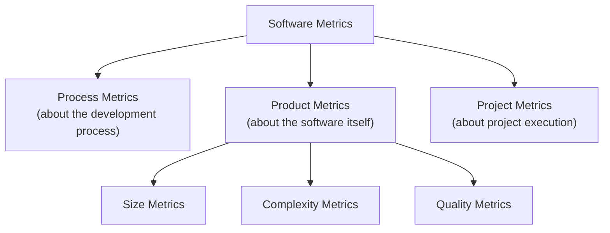
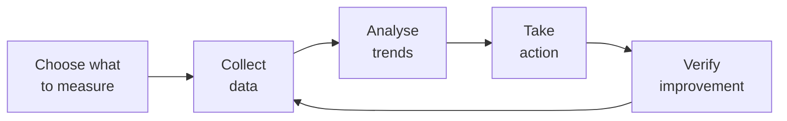

## You Cannot Improve What You Cannot Measure

Software metrics are quantitative measures that let us assess software products and processes objectively, rather than relying on intuition. Without metrics, statements like "this code is too complex" or "quality is improving" are just opinions.

**Real-world analogy:** A doctor measures temperature, blood pressure, and heart rate — objective numbers that guide diagnosis. Software metrics are the vital signs of a software product. They tell us where problems may be hiding and whether interventions are working.

---

## Categories of Software Metrics



| Category | Measures | Examples |
|---|---|---|
| **Process metrics** | The development process | Defect detection rate, time per phase |
| **Product metrics** | The software product | Lines of code, complexity, defect density |
| **Project metrics** | Project execution | Cost, schedule, team size, productivity |

This topic focuses on **product metrics**.

---

## Size Metrics

### Lines of Code (LOC)
Counts the number of source code lines. Variants:
- **Physical LOC:** Every line including comments and blanks
- **Logical LOC:** Only executable statements

**Limitation:** Language-dependent and easy to game. Used mainly with historical data.

### Function Points (FP)
A language-independent measure of functionality (covered in the Estimation topic). Better for comparing systems written in different languages.

---

## Complexity Metrics

### Cyclomatic Complexity (McCabe's Metric)

The most important complexity metric. It measures the number of **linearly independent paths** through a program's code — essentially, how many decision points exist.

**Formula:**

$$V(G) = E - N + 2$$

Where $E$ = number of edges, $N$ = number of nodes in the control flow graph.

**Simpler counting method:**

$$V(G) = (\text{number of decision points}) + 1$$

A decision point is any `if`, `while`, `for`, `case`, `&&`, or `||`.

**Worked example:**

```java
public String classify(int score) {
    if (score >= 70) {           // decision 1
        return "A";
    } else if (score >= 50) {    // decision 2
        return "C";
    } else {
        return "F";
    }
}
```

Decision points: 2 (two `if`/`else if` conditions).

$$V(G) = 2 + 1 = 3$$

**Interpretation of cyclomatic complexity:**

| $V(G)$ | Risk level |
|---|---|
| 1–10 | Simple, low risk |
| 11–20 | Moderate complexity |
| 21–50 | High complexity, high risk |
| > 50 | Very high risk, untestable |

**Why it matters:**
- $V(G)$ equals the minimum number of test cases needed for full branch coverage
- High complexity correlates with high defect rates
- Functions with $V(G) > 10$ should be considered for refactoring

### Depth of Inheritance Tree (DIT)
For OOP systems, measures how deep a class is in the inheritance hierarchy. Deep inheritance (DIT > 5) makes code harder to understand.

### Coupling Between Objects (CBO)
Counts the number of other classes a class is coupled to. High CBO indicates poor modularity — changes ripple widely.

---

## Quality Metrics

### Defect Density
Defects per unit of size:

$$\text{Defect Density} = \frac{\text{Number of defects}}{\text{Size (KLOC or FP)}}$$

**Example:** A 20 KLOC system with 60 defects found:

$$\text{Defect Density} = \frac{60}{20} = 3 \text{ defects per KLOC}$$

Lower is better. Industry benchmarks: well-managed projects achieve < 1 defect/KLOC in delivered code.

### Defect Removal Efficiency (DRE)

$$\text{DRE} = \frac{\text{Defects found before release}}{\text{Total defects (before + after release)}} \times 100\%$$

**Example:** 90 defects found during testing, 10 found after release by users:

$$\text{DRE} = \frac{90}{90 + 10} \times 100\% = 90\%$$

Higher DRE means more defects were caught before customers saw them.

### Mean Time Between Failures (MTBF)
For reliability: the average operational time between system failures. Higher MTBF = more reliable.

---

## Using Metrics Wisely

Metrics are powerful but dangerous if misused.

### The Right Way
- Use metrics to **identify areas needing attention** (e.g., "this module has high complexity — let's review it")
- Track trends over time (is defect density improving?)
- Combine multiple metrics for a fuller picture

### The Wrong Way (Anti-patterns)
- **Goodhart's Law:** "When a measure becomes a target, it ceases to be a good measure." If you reward developers for lines of code, they write verbose code. If you reward few defects, they stop reporting defects.
- Using a single metric in isolation
- Comparing metrics across different languages or contexts without adjustment

**Example of metric abuse:** A manager pays bonuses based on LOC written. Developers respond by writing inefficient, verbose code with unnecessary lines — degrading quality while increasing the metric.

---

## The Metrics Collection Process



1. **Choose** metrics aligned with quality goals
2. **Collect** data automatically where possible (tools like SonarQube)
3. **Analyse** for trends and outliers
4. **Act** on insights (refactor complex modules, improve testing)
5. **Verify** the action improved the metric

---

## Key Takeaway

> Software product metrics quantify software quality objectively. Size metrics (LOC, function points) measure how big software is. Complexity metrics — especially cyclomatic complexity $V(G) = \text{decisions} + 1$ — predict defect-proneness and testing effort. Quality metrics like defect density and defect removal efficiency assess product quality. Metrics must be used to guide improvement, not as targets in themselves (Goodhart's Law) — gaming metrics destroys their value.

---

## Exam Tips

**What lecturers test:**
- Calculate cyclomatic complexity from given code (count decisions + 1)
- Calculate defect density and defect removal efficiency
- Distinguish process, product, and project metrics
- Explain the dangers of using metrics as targets (Goodhart's Law)
- State the relationship between cyclomatic complexity and test cases

**Likely question:**
> "Define cyclomatic complexity and state its formula. Calculate the cyclomatic complexity of a given function with 4 decision points. Explain what the value tells you about testing the function." (8 marks)
