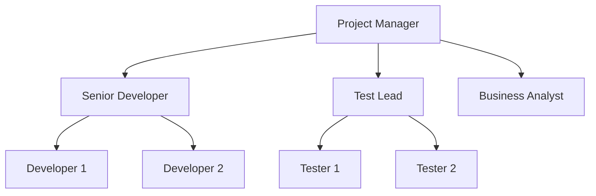

## Why Software Projects Are Different

Managing a software project is harder than managing most other engineering projects because:

- **Invisibility:** Software has no physical substance — progress is hard to measure
- **Complexity:** Software can be vastly more complex per unit than any other human artefact
- **Conformity:** Software must conform to requirements of the human systems it works with — and humans are unpredictable
- **Flexibility:** Software can be changed, which creates constant pressure to change it (scope creep)

**Real-world analogy:** Building a bridge is hard — but once the design is fixed, you can measure progress in steel tons and concrete poured. Building software is like building a bridge where the requirements change mid-construction, the materials have no physical weight, and the customer keeps adding new floors.

---

## The Project Plan

In a plan-driven approach, the **project plan** documents the resources, work breakdown, and schedule. It is the master document for managing the project.

### The Seven Sections of a Project Plan

**Section 1: Introduction**
Brief description of project objectives and constraints (budget, time, technology).

**Section 2: Project Organisation**
How the development team is structured, the roles of each person, reporting lines.



**Section 3: Risk Analysis**
Identify potential risks, their likelihood, and risk reduction strategies.

| Risk | Likelihood | Impact | Mitigation |
|---|---|---|---|
| Key developer leaves | Medium | High | Knowledge documentation, pair programming |
| Requirements change | High | High | Agile approach, change control |
| Integration failure | Medium | High | Early integration testing |
| Schedule overrun | Medium | Medium | Conservative estimates, buffer |

**Section 4: Hardware and Software Resources**
Specify the hardware and software tools needed for development, testing, and deployment.

**Section 5: Work Breakdown**
Break the project into activities. Each activity has:
- A **milestone** — a key stage where progress can be assessed (e.g., "Requirements sign-off complete")
- A **deliverable** — a work product delivered to the customer (e.g., "Requirements document")

```
Work Breakdown Structure:
1. Requirements Engineering
   1.1 Stakeholder interviews
   1.2 Requirements documentation
   MILESTONE: Requirements approved by customer
   DELIVERABLE: Software Requirements Specification

2. Design
   2.1 Architectural design
   2.2 Detailed design
   2.3 Design review
   MILESTONE: Design baseline established
   DELIVERABLE: Design document

3. Implementation
   3.1 Frontend development
   3.2 Backend development
   3.3 Database setup
   MILESTONE: Code complete

4. Testing
   4.1 Unit testing
   4.2 Integration testing
   4.3 System testing
   4.4 User acceptance testing
   MILESTONE: All tests passed
   DELIVERABLE: Test report

5. Deployment
   DELIVERABLE: Deployed system
```

**Section 6: Project Schedule**
Shows the timeline, dependencies between activities, and resource allocation.

**Gantt Chart (simplified):**

```
Activity            | Week: 1  2  3  4  5  6  7  8  9  10
--------------------|------------------------------------
Requirements        | [====]
Design              |    [======]
Implementation      |          [===============]
Testing             |                     [=======]
Deployment          |                           [===]
```

Gantt charts show which activities are happening when, and whether they are on schedule.

**Network Diagrams (CPM):** Show dependencies between activities. The **critical path** is the longest path through the network — it determines the minimum project duration. Any delay on the critical path delays the whole project.

**Section 7: Monitoring and Reporting Mechanisms**
How progress is tracked and reported:
- Weekly status meetings
- Progress reports every two weeks
- Milestone completion sign-offs
- Issue logs

---

## Team Management

Software is built by people. Project management is largely people management.

### Team Structures

**Hierarchical team:**
```
Project Manager
├── Team Lead
│   ├── Developer A
│   ├── Developer B
│   └── Developer C
└── Team Lead
    └── ...
```
Clear authority, but slow communication. Good for large formal projects.

**Self-organising agile team:**
```
[Product Owner] ← → [Scrum Master] ← → [Dev Team (5-9 people)]
```
Fast, flexible. Each member can do multiple roles. Good for smaller agile projects.

### Motivation
People work best when they:
- Have meaningful work
- Can see the results of their efforts
- Are treated with respect
- Have opportunities to learn and grow
- Are fairly compensated

Demotivating a software team is easy: assign boring work, never explain why, micromanage, take credit for others' work, ignore contributions.

### Managing Remote/Distributed Teams
Common in modern software development:
- Regular video calls (not just email/chat)
- Clear documentation of decisions
- Explicit agreements about working hours and response times
- Team-building activities even virtually

---

## Project Monitoring and Control

A plan without monitoring is a wish. Project managers must track actual progress against the plan and take corrective action when deviation occurs.

### Earned Value Analysis (EVA)
A quantitative technique for measuring project progress:

- **Planned Value (PV):** Budgeted cost of work scheduled
- **Earned Value (EV):** Budgeted cost of work actually performed
- **Actual Cost (AC):** Actual cost of work performed

**Schedule Variance (SV) = EV - PV** (positive = ahead, negative = behind)  
**Cost Variance (CV) = EV - AC** (positive = under budget, negative = over budget)

---

## Key Takeaway

> Software project management addresses the unique challenges of software: invisibility, complexity, conformity, and flexibility. The project plan's seven sections cover objectives, organisation, risk, resources, work breakdown (with milestones and deliverables), schedule (Gantt charts, critical path), and monitoring mechanisms. The critical path determines minimum project duration. Team management is fundamentally about motivation — software is built by people, and people perform best when engaged, respected, and trusted.

---

## Exam Tips

**What lecturers test:**
- List and explain the seven sections of a project plan
- Define milestone vs. deliverable with examples
- Explain what a Gantt chart shows and draw a simple one
- Define critical path — what happens if a critical path activity is delayed?
- Explain Earned Value Analysis (EV, PV, AC, SV, CV)

**Likely question:**
> "List the seven sections of a software project plan. For three sections, describe what is documented and why it is important." (12 marks)
