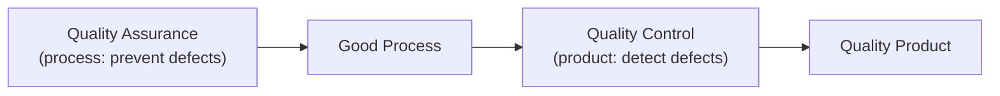
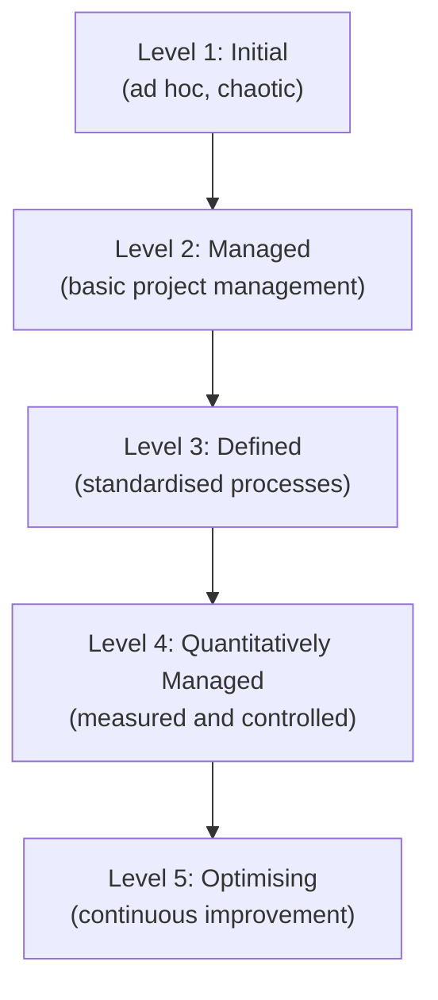

## What Is Software Quality?

Software quality is the degree to which a software product meets its requirements and satisfies its users. But quality is multi-dimensional — a system can be fast but insecure, or feature-rich but unusable.

**Real-world analogy:** The quality of a car is not a single number. It includes safety, fuel efficiency, comfort, reliability, and performance. A "quality" car balances these. Software quality is similarly multi-dimensional, and the relevant dimensions depend on the system's purpose.

---

## Quality Attributes (The "-ilities")

Software quality is decomposed into attributes, often called the "-ilities":

| Attribute | Question it answers |
|---|---|
| **Functionality** | Does it do what it should? |
| **Reliability** | Does it work consistently without failure? |
| **Usability** | Is it easy to learn and use? |
| **Efficiency** | Does it use resources well (speed, memory)? |
| **Maintainability** | Is it easy to modify? |
| **Portability** | Does it run in different environments? |
| **Security** | Is it protected against attacks? |
| **Scalability** | Can it handle increasing load? |

These map to international standards like **ISO/IEC 25010** (the Software Product Quality model).

---

## Quality Assurance vs. Quality Control

A critical distinction often confused:

| Quality Assurance (QA) | Quality Control (QC) |
|---|---|
| **Process-oriented** | **Product-oriented** |
| Prevents defects | Detects defects |
| "Are we doing the right things?" | "Did we build it correctly?" |
| Defines standards and processes | Tests and inspects the product |
| Proactive | Reactive |
| Example: defining a code review process | Example: running tests on the code |

**Analogy:** QA is like designing a clean, hygienic kitchen with proper procedures (preventing contamination). QC is like inspecting each dish before it leaves the kitchen (detecting problems). You need both.

---

## Quality Assurance Activities

### 1. Defining Standards
Establish coding standards, documentation standards, and process standards that all team members follow.

**Examples:**
- Naming conventions (camelCase for variables, PascalCase for classes)
- Code formatting rules
- Required documentation for each module
- Definition of "done" for a feature

### 2. Reviews and Audits
Systematically inspect work products (code, documents, designs) against standards.

### 3. Process Definition and Improvement
Define how work is done, measure how well the process works, and continuously improve it.

---

## Quality Control Activities

### Testing
All levels: unit, integration, system, acceptance (covered in the Testing topics).

### Inspections and Walkthroughs
Static examination of work products to find defects.

### Defect Tracking
Recording, prioritising, and verifying the resolution of every defect found.

---

## Quality Standards and Models

### ISO 9001
A general quality management standard applicable to any industry, including software. It requires organisations to:
- Document their processes
- Follow their documented processes
- Continuously improve

**Key principle:** "Say what you do, do what you say, and prove it." ISO 9001 certification demonstrates an organisation has a managed quality process.

### CMMI (Capability Maturity Model Integration)
A model specifically for assessing and improving software development process maturity. It defines five maturity levels:

| Level | Name | Characteristic |
|---|---|---|
| 1 | Initial | Processes unpredictable, reactive, chaotic |
| 2 | Managed | Projects planned and tracked |
| 3 | Defined | Organisation-wide standard processes |
| 4 | Quantitatively Managed | Processes measured with metrics |
| 5 | Optimising | Focus on continuous process improvement |

Higher CMMI levels correlate with more predictable, higher-quality software delivery. Many large organisations require their software suppliers to be at CMMI Level 3 or above.

---

## The Cost of Quality

Quality has costs — but so does the lack of quality.

**Cost of Good Quality (prevention + appraisal):**
- Training, standards, reviews, testing tools

**Cost of Poor Quality (failure costs):**
- Internal failures: rework, re-testing
- External failures: customer-reported bugs, reputation damage, legal liability, lost customers

**The key insight:** Investing in quality assurance (prevention) is far cheaper than paying for poor quality (failure costs). A defect that costs $1 to prevent in design might cost $100 to fix in production (recall the cost escalation curve from the Validation topic).

---

## Building a Quality Culture

Quality is not just a process — it is a culture. Characteristics of a quality-focused team:

- Everyone is responsible for quality, not just the QA team
- Defects are seen as learning opportunities, not blame opportunities
- Continuous improvement is expected
- Quality is built in, not tested in
- Time for proper testing and review is protected, not cut when schedules slip

---

## Key Takeaway

> Software quality is multi-dimensional, defined by attributes like reliability, usability, maintainability, and security. Quality Assurance (QA) is process-oriented and proactive — it prevents defects by defining and following good processes. Quality Control (QC) is product-oriented and reactive — it detects defects through testing and inspection. Standards like ISO 9001 (general quality management) and CMMI (process maturity, 5 levels) provide frameworks. Investing in quality prevention is far cheaper than paying for the consequences of poor quality.

---

## Exam Tips

**What lecturers test:**
- Distinguish QA (process, prevention) from QC (product, detection)
- List and explain key software quality attributes (the "-ilities")
- Describe the five CMMI maturity levels
- Explain the cost of quality argument (prevention vs. failure costs)
- Explain what ISO 9001 requires of an organisation

**Likely question:**
> "Distinguish between Quality Assurance and Quality Control with examples. Describe the five levels of the CMMI model and explain what improving from Level 1 to Level 3 means for a software organisation." (12 marks)
