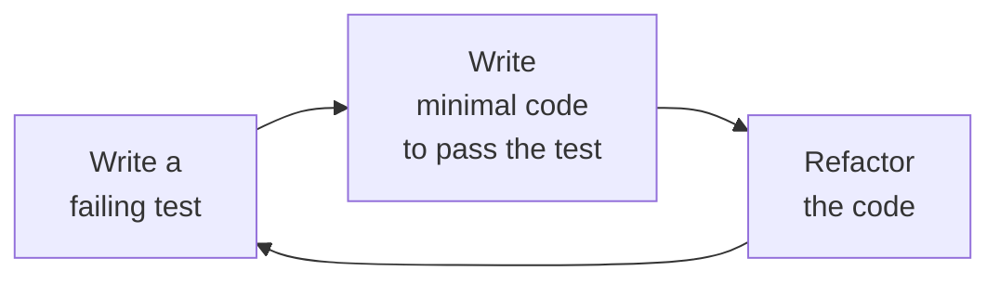

## The Purpose of Testing

Testing is not about proving software works. It is about **finding defects**. Dijkstra's famous observation: "Program testing can be used to show the presence of bugs, but never to show their absence."

You can never test every possible input — for any real program, the input space is infinite. Instead, you design tests strategically to maximise the probability of finding defects with the available time.

**Real-world analogy:** Quality control at a factory does not inspect every product — it inspects a statistically representative sample. A single defective product in the sample fails the batch. Similarly, a well-designed test set can reveal systematic defects even without testing every case.

---

## Black-Box vs. White-Box Testing

### Black-Box Testing
Tests are derived from the **specification** — testers do not know or care about the internal code structure. They only see inputs and expected outputs.

```
Specification:
  calculateGrade(score):
    70-100 → "A", 60-69 → "B", 50-59 → "C", 40-49 → "D/E", 0-39 → "F"

Black-box tests (derived from spec, ignoring code):
  calculateGrade(80) → "A"
  calculateGrade(65) → "B"
  calculateGrade(55) → "C"
  calculateGrade(-1) → error
```

**Advantages:** Tests validate the requirements, not the implementation. Tests are not biased by the code.

**Techniques:** Equivalence partitioning, boundary value analysis, use-case testing.

### White-Box (Glass-Box) Testing
Tests are derived from the **code structure** — testers know the implementation and design tests to exercise specific code paths.

**Coverage criteria:**
- **Statement coverage:** Every statement in the code is executed by at least one test
- **Branch coverage:** Every branch (true/false) of every condition is executed
- **Path coverage:** Every possible execution path through the code is exercised

```java
public String classify(int n) {
    if (n > 0) {           // Branch A: n > 0
        return "positive"; // Statement 1
    } else if (n < 0) {    // Branch B: n < 0
        return "negative"; // Statement 2
    } else {
        return "zero";     // Statement 3
    }
}

// White-box tests for branch coverage (need one test per branch):
classify(5)   → "positive" (covers Branch A true, Statements 1)
classify(-3)  → "negative" (covers Branch A false + Branch B true, Statement 2)
classify(0)   → "zero"     (covers both conditions false, Statement 3)
```

**Advantages:** Can find dead code (code that can never be executed), logic errors, and security vulnerabilities.

---

## Test-Driven Development (TDD)

TDD is an Agile practice where you write the **test before** the code. The cycle is:



**Red → Green → Refactor:**
1. **Red:** Write a test that fails (because the code does not exist yet)
2. **Green:** Write the minimum code to make the test pass
3. **Refactor:** Improve the code quality without changing behaviour

**Example:** Implementing `calculateGrade(score)` using TDD:

```
Step 1 (Red): Write test:
  ASSERT calculateGrade(75) == "A"   ← fails (function not written)

Step 2 (Green): Write minimum code:
  return "A"   ← passes the test (trivially)

Step 3 (Red): Add next test:
  ASSERT calculateGrade(65) == "B"   ← fails ("A" is always returned)

Step 2 (Green): Improve code:
  if score >= 70: return "A"
  else: return "B"   ← passes both tests

Step 3 (Red): Add next test:
  ASSERT calculateGrade(55) == "C"   ← fails
```

Continue until all tests pass. The test suite is now a specification.

**Benefits of TDD:**
- Forces you to think about requirements before coding
- Produces high test coverage automatically
- Refactoring is safe — tests catch regressions
- Results in smaller, more focused functions

---

## Regression Testing

After modifying software (adding features, fixing bugs), **regression testing** ensures that the changes have not broken functionality that previously worked.

**Process:**
1. Maintain a test suite from all previous testing
2. After every change, re-run the full test suite
3. Any previously passing test that now fails = **regression**
4. Investigate and fix before releasing the change

Regression testing is automated in CI/CD (Continuous Integration/Continuous Delivery) pipelines — every code commit automatically triggers the full test suite.

---

## Test Planning

A **Test Plan** documents the testing approach for the entire project:

| Section | Content |
|---|---|
| Scope | What will and will not be tested |
| Testing strategy | Levels (unit, integration, system, acceptance), techniques (black/white box) |
| Resources | Team members, tools, environments |
| Schedule | When each testing phase occurs |
| Entry/exit criteria | Conditions for starting/completing each phase |
| Defect reporting | How to document and track defects |

---

## Testing Techniques in Practice

### Equivalence Partitioning
Group valid and invalid inputs into classes. Test one representative from each class.

**Example — password validation (6–12 characters, no spaces):**

| Class | Type | Representative |
|---|---|---|
| 6–12 chars, no spaces | Valid | `"pass123"` |
| < 6 chars | Invalid (too short) | `"abc"` |
| > 12 chars | Invalid (too long) | `"verylongpassword"` |
| Contains spaces | Invalid | `"pass word"` |
| Empty string | Invalid (edge case) | `""` |

### Boundary Value Analysis
Test at boundaries and one value beyond:

For length 6–12: test lengths 5, **6**, 7, 11, **12**, 13.

---

## Defect Reporting

When a test fails, the tester logs a **defect report** containing:

1. Defect ID
2. Severity (critical/major/minor/cosmetic)
3. Steps to reproduce (exact, repeatable)
4. Expected result
5. Actual result
6. Environment (OS, browser, version)
7. Screenshot/log if available

**Example defect:**
```
ID: BUG-042
Severity: Critical
Steps: 1. Navigate to Grade Calculator. 2. Enter score -1. 3. Click Calculate.
Expected: Error message "Score must be 0-100"
Actual: System crashes with NullPointerException
Environment: Chrome 120, Windows 11
```

---

## Key Takeaway

> Testing aims to find defects, not prove correctness. Black-box testing derives tests from specifications; white-box testing derives tests from code structure. TDD reverses the order — tests come before code, driving design and ensuring coverage. Regression testing ensures changes don't break existing functionality. All testing requires systematic test case design: equivalence partitioning and boundary value analysis maximise defect detection with minimum test cases.

---

## Exam Tips

**What lecturers test:**
- Define and distinguish black-box and white-box testing
- Explain TDD — what is the Red-Green-Refactor cycle?
- Apply equivalence partitioning and boundary value analysis to design test cases
- Define regression testing and explain when it is used
- Describe what a defect report should contain

**Likely question:**
> "For a function that takes a student score (0–100) and returns a grade, design a complete set of black-box test cases using equivalence partitioning and boundary value analysis. Show the equivalence classes and test cases." (10 marks)
