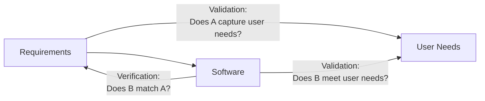
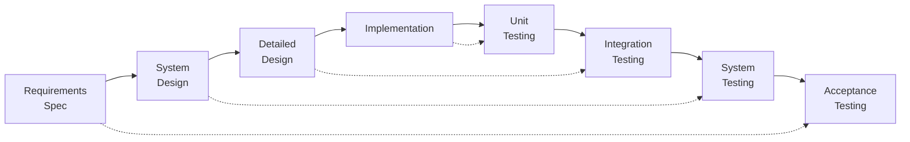
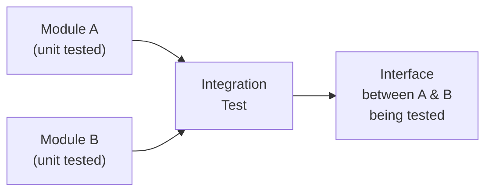
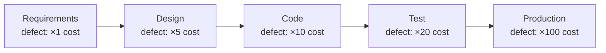

## The Fundamental Question

After building software, you must ask two questions:

1. **Verification:** Did we build the product right? (Does the software match its specification?)
2. **Validation:** Did we build the right product? (Does the software do what the customer actually needs?)

These are different questions. You can build software that exactly matches a requirements document (verification passes) but still fails validation because the requirements themselves did not capture what the customer really needed.

**Analogy:** Verification checks that a bridge was built according to the blueprints. Validation checks that the bridge serves the transportation needs it was designed for.



---

## The V-Model of V&V

The V-model shows how each development phase corresponds to a testing phase:



Each left-side (development) phase has a corresponding right-side (testing) phase. The connection (dashed) shows what each test phase verifies.

---

## Levels of Testing

### Unit Testing
Tests individual components in isolation. Developers write and run unit tests for each function/class as they implement it.

**What it checks:** Does this function return the correct result for all valid inputs? Does it handle edge cases and invalid inputs correctly?

```
METHOD calculateGrade(score):
  if score >= 70: return "A"
  if score >= 60: return "B"
  ...

Unit tests:
  calculateGrade(75) → should return "A" ✓
  calculateGrade(65) → should return "B" ✓
  calculateGrade(50) → should return "C" ✓
  calculateGrade(0)  → should return "F" ✓
  calculateGrade(-1) → should raise exception ✓
  calculateGrade(101) → should raise exception ✓
```

**Tools:** JUnit (Java), pytest (Python), Mocha (JavaScript).

### Integration Testing
Tests how components work together. Individual modules may work perfectly in isolation but fail when combined — because interfaces were misunderstood or assumptions were wrong.

**Example:** The GradeCalculator module and the DatabaseConnection module each pass unit tests. But when GradeCalculator calls the database, the data format returned does not match what GradeCalculator expects → integration failure.



### System Testing
Tests the complete integrated system against the requirements specification. Black-box testing — testers do not know the internal structure, only the specified inputs and expected outputs.

**Types of system tests:**
- **Functional testing:** Does each specified function work?
- **Performance testing:** Does it meet response time requirements?
- **Load/stress testing:** Does it remain stable under heavy usage?
- **Security testing:** Can it be broken into?
- **Usability testing:** Can users accomplish their tasks?

### Acceptance Testing
Customer-facing test. The customer or their representatives test the system to decide whether to accept (and pay for) it.

- **User Acceptance Testing (UAT):** Real users test in a realistic environment
- **Alpha testing:** Testing done at the developer's site with representative users
- **Beta testing:** System released to a limited group of users before full release

---

## Static V&V: Inspections and Reviews

Testing is **dynamic** — you run the software and observe behaviour. But defects can also be found **statically** — by reading the code or documents without executing anything.

### Code Reviews
Peers read each other's code to find defects before testing. Studies show that inspection finds a different (and complementary) set of defects to testing.

**Structured inspection process:**
1. Author distributes code
2. Reviewers read independently
3. Meeting to discuss findings
4. Author fixes defects
5. Follow-up to verify fixes

### Benefits of Inspections Over Testing
- Find defects early (cheaper to fix)
- Can inspect requirements documents and design documents — not just code
- Reviewers explain why they made design choices, improving team knowledge

### Formal Reviews vs. Informal Reviews

| Review type | Structure | When used |
|---|---|---|
| **Walkthrough** | Author presents their work; peers ask questions | Early design review |
| **Formal Inspection** | Structured meeting with defined roles (moderator, reader, recorder) | Critical code, safety-critical systems |
| **Informal Review** | Two developers discussing code at a desk | Daily development practice |

---

## Test Case Design

A **test case** is a documented input, expected output, and execution condition. Good test cases are designed systematically, not ad hoc.

### Equivalence Partitioning
Divide the input space into equivalence classes — groups of inputs that should all be treated the same way. Test one value from each class.

**Example:** For a score input (0–100):
- Valid class 1: 0–100 (any one value from here)
- Invalid class 1: < 0 (test: -1)
- Invalid class 2: > 100 (test: 101)

**Boundary Value Analysis:** Test at and just beyond the boundaries of equivalence classes.

For score 0–100: test values **-1, 0, 1, 50, 99, 100, 101**

---

## The Cost of Late Defect Detection

Defects found late are exponentially more expensive to fix:



**Why:** Fixing a requirements defect might mean rewriting two paragraphs. Fixing the same defect in production might mean rewriting thousands of lines of code, redeploying, and correcting data that has already been processed incorrectly.

This is why early testing (unit testing, code reviews, requirements inspection) pays for itself many times over.

---

## Key Takeaway

> Validation asks "are we building the right thing?" Verification asks "are we building it right?" Software V&V combines dynamic testing (unit, integration, system, acceptance) with static inspection (code reviews, walkthroughs). Defects found early cost a fraction of defects found late. Test cases must be designed systematically using techniques like equivalence partitioning and boundary value analysis — not just "try it and see."

---

## Exam Tips

**What lecturers test:**
- Distinguish verification and validation with clear examples
- Draw the V-model and explain each testing level
- Define unit, integration, system, and acceptance testing — what each tests and who performs it
- Explain equivalence partitioning and boundary value analysis
- Explain why finding defects early is cheaper

**Likely question:**
> "Distinguish between verification and validation. Describe the four levels of testing in the V-model, stating what is tested and who performs each level." (12 marks)
