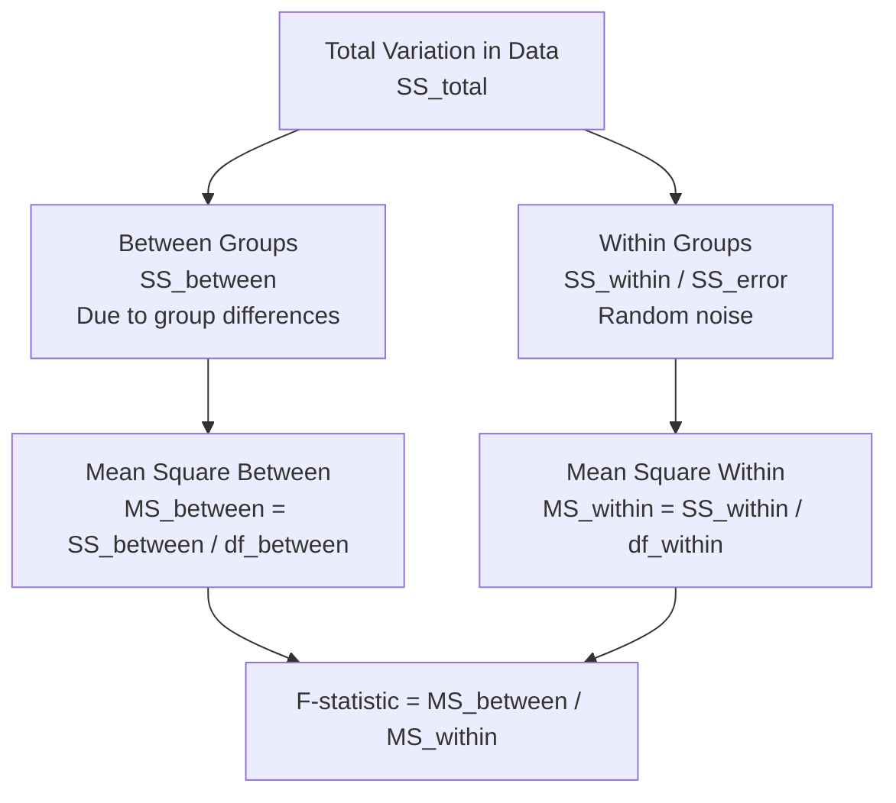
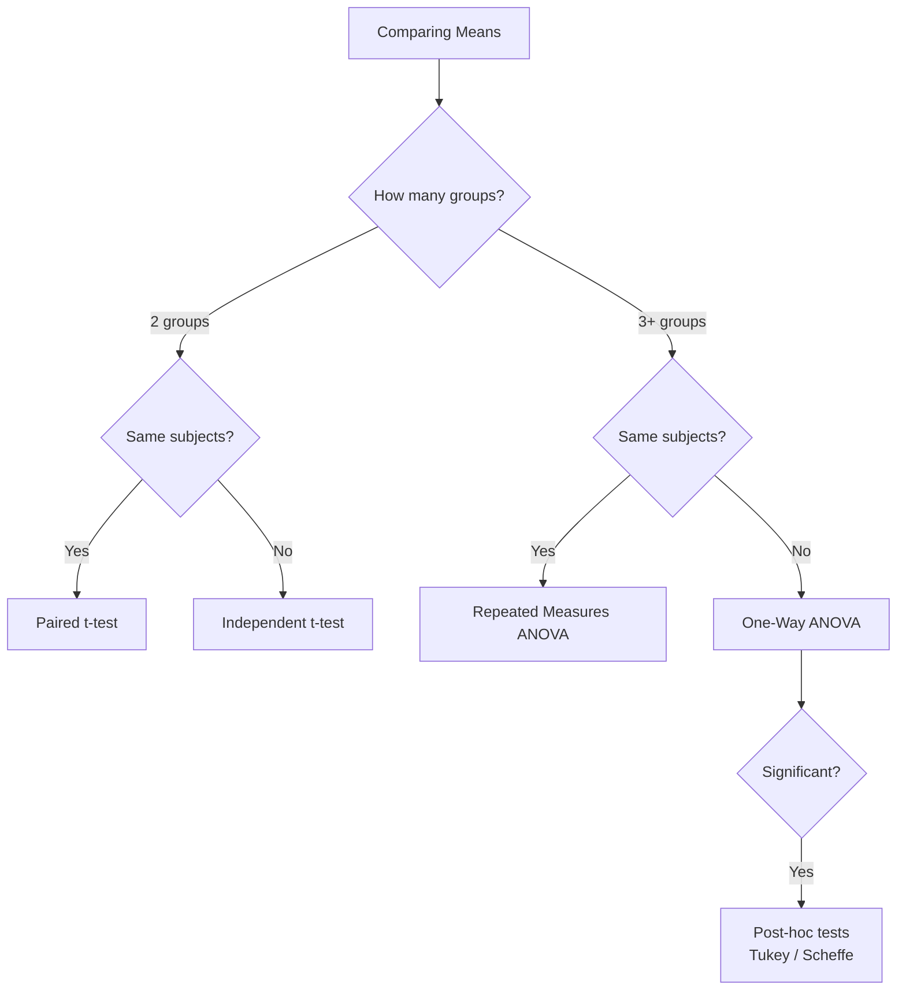

# Analysis of Variance (ANOVA)

The t-test compares the means of two groups. But what if you have three or more groups? "Which of these three diets produces the most weight loss?" "Are the mean strengths of four different concrete mixes significantly different?" Running multiple t-tests would inflate the probability of false positives. **ANOVA** is the correct tool for comparing means across three or more groups simultaneously.

---

## The Core Idea: Partitioning Variance

ANOVA works by decomposing the total variation in your data into two components:

1. **Variation between groups** (due to actual differences between group means)
2. **Variation within groups** (random noise — individuals in the same group differ from each other)

If the variation **between** groups is much larger than the variation **within** groups, we have evidence that the group means are genuinely different.

> **Analogy:** Imagine measuring plant heights from 3 farms using different fertilisers. If the plants within each farm all look roughly the same but the three farms look very different from each other, you'd conclude the fertiliser matters. That ratio of "between-farm" to "within-farm" variability is exactly what the F-statistic measures.

---

## Hypotheses in One-Way ANOVA

**$H_0$:** All group means are equal: $\mu_1 = \mu_2 = \cdots = \mu_k$

**$H_1$:** At least one group mean differs from the others

This is a single test for all groups simultaneously. If $H_0$ is rejected, you know **some** means are different, but not which ones — that requires **post-hoc tests**.

---

## The ANOVA Formulas

Let there be $k$ groups, with $n_j$ observations in group $j$. Total observations: $N = \sum n_j$.

Let $x_{ij}$ = $i$-th observation in group $j$, $\bar{x}_j$ = mean of group $j$, $\bar{x}_T$ = overall (grand) mean.

### Sums of Squares

**SS Between Groups (Treatment):**
$$SS_{\text{between}} = \sum_{j=1}^{k} n_j (\bar{x}_j - \bar{x}_T)^2$$

This measures how much the group means deviate from the overall mean.

**SS Within Groups (Error):**
$$SS_{\text{within}} = \sum_{j=1}^{k} \sum_{i=1}^{n_j} (x_{ij} - \bar{x}_j)^2$$

This measures how much individual observations deviate from their own group mean.

**SS Total:**
$$SS_{\text{total}} = \sum_{j=1}^{k} \sum_{i=1}^{n_j} (x_{ij} - \bar{x}_T)^2 = SS_{\text{between}} + SS_{\text{within}}$$

### Degrees of Freedom

| Source | df |
|--------|-----|
| Between groups | $k - 1$ |
| Within groups (error) | $N - k$ |
| Total | $N - 1$ |

### Mean Squares

$$MS_{\text{between}} = \frac{SS_{\text{between}}}{k-1}$$

$$MS_{\text{within}} = \frac{SS_{\text{within}}}{N-k}$$

### The F-Statistic

$$\boxed{F = \frac{MS_{\text{between}}}{MS_{\text{within}}}}$$

- If $F \approx 1$: variation between groups ≈ variation within groups — no evidence of differences
- If $F \gg 1$: variation between groups is much larger — groups genuinely differ

The F-statistic follows an **F-distribution** with $(k-1, N-k)$ degrees of freedom under $H_0$.

---

## The ANOVA Table

Results are summarised in an ANOVA table:

| Source | SS | df | MS | F |
|--------|----|----|----|---|
| Between groups (Treatment) | $SS_B$ | $k-1$ | $MS_B = SS_B/(k-1)$ | $F = MS_B/MS_W$ |
| Within groups (Error) | $SS_W$ | $N-k$ | $MS_W = SS_W/(N-k)$ | |
| Total | $SS_T$ | $N-1$ | | |

---

## Worked Example 1: Which Diet is Best?

Three diets are tested for weight loss. 78 people are randomly assigned: 24 to Diet 1, 27 to Diet 2, 27 to Diet 3.

**Summary statistics:**

| | Diet 1 | Diet 2 | Diet 3 | Overall |
|--|--------|--------|--------|---------|
| $n$ | 24 | 27 | 27 | 78 |
| $\bar{x}$ (kg) | 3.30 | 3.03 | 5.15 | 3.85 |
| $s$ | 2.24 | 2.52 | 2.40 | 2.55 |

**Step 1 — SS Between:**
$$SS_B = 24(3.30-3.85)^2 + 27(3.03-3.85)^2 + 27(5.15-3.85)^2$$
$$= 24(0.3025) + 27(0.6724) + 27(1.6900)$$
$$= 7.26 + 18.16 + 45.63 = 71.05$$

**Step 2 — SS Within** (from the individual data — we compute from group SDs):
$$SS_W = (n_1-1)s_1^2 + (n_2-1)s_2^2 + (n_3-1)s_3^2$$
$$= 23(2.24)^2 + 26(2.52)^2 + 26(2.40)^2$$
$$= 23(5.018) + 26(6.350) + 26(5.760)$$
$$= 115.41 + 165.10 + 149.76 = 430.27$$

**Step 3 — ANOVA Table:**

| Source | SS | df | MS | F |
|--------|----|----|----|---|
| Between | 71.05 | 2 | 35.53 | 6.20 |
| Within | 430.27 | 75 | 5.74 | |
| Total | 501.32 | 77 | | |

**Step 4 — Decision:**
$F = 6.20$. At $\alpha = 0.05$ with $(2, 75)$ df, $F_{crit} \approx 3.12$.

Since $6.20 > 3.12$, **reject $H_0$** — not all three diets produce the same mean weight loss.

**p-value = 0.003** — strong evidence of a difference.

---

## Post-Hoc Tests: Which Groups Differ?

When ANOVA rejects $H_0$, it tells you that **at least one** group differs. To find **which specific pairs** are different, you use post-hoc tests. These are pairwise t-tests with adjustments to control the overall Type I error rate.

**Common post-hoc tests:**
- **Tukey's HSD:** Most commonly used when group sizes are equal
- **Scheffe's test:** More conservative, suitable for unequal sizes
- **Hochberg's GT2:** Preferred when group sizes are very different

### Worked Example 2: Post-Hoc Results for the Diet Study

| Comparison | p-value | Significant? |
|-----------|---------|-------------|
| Diet 1 vs Diet 2 | 0.912 | No |
| Diet 1 vs Diet 3 | 0.020 | Yes |
| Diet 2 vs Diet 3 | 0.005 | Yes |

**Conclusion:** Diets 1 and 2 are not significantly different from each other. Both are significantly worse than Diet 3. **Diet 3 is the best** for weight loss (mean = 5.15 kg vs 3.30 and 3.03 kg).

---

## Assumptions of One-Way ANOVA

| Assumption | How to Check | What to Do If Violated |
|-----------|-------------|----------------------|
| **Normality** of residuals (each group approximately normal) | Histogram of residuals or Q-Q plot | Use Kruskal-Wallis (non-parametric equivalent) |
| **Homogeneity of variance** (similar SDs across groups) | Check that no SD is more than twice another; Levene's test | Use Welch's ANOVA or Kruskal-Wallis |
| **Independence** of observations | Study design check | Restructure design |

If the SD of one group is more than twice the smallest SD, variances may be too unequal for standard ANOVA.

**Kruskal-Wallis test:** The non-parametric equivalent of one-way ANOVA — uses ranks instead of raw values, makes no normality assumption.

---

## Two-Way ANOVA

**One-way ANOVA** has one categorical independent variable (e.g., diet type).

**Two-way ANOVA** has **two** categorical independent variables (e.g., diet type AND gender). It tests:
1. Main effect of factor 1 (diet)
2. Main effect of factor 2 (gender)
3. **Interaction effect** — whether the effect of one factor depends on the level of the other

### What is an Interaction?

An interaction occurs when the effect of one variable changes depending on the level of another.

> **Example:** If Diet 3 works better for women than for men, but Diet 1 works equally well for both sexes, there is an **interaction between diet and gender**. A plot of mean weight loss by diet for each gender would show crossing lines.

If lines are **parallel** → no interaction (the effect of diet is the same for men and women).  
If lines **cross or diverge** → interaction present.

---

## Comparing Tests: When to Use What

---

> **Key Takeaways**
>
> - ANOVA tests whether **multiple group means** are simultaneously equal; the null hypothesis is $\mu_1 = \mu_2 = \cdots = \mu_k$
> - The **F-statistic** = MS between ÷ MS within. A large F means between-group variation dominates — evidence of real differences
> - ANOVA only tells you *that* differences exist; **post-hoc tests** (Tukey's, Scheffe's) identify *which* pairs differ
> - Assumptions: approximately normal residuals and similar variances across groups. If violated, use Kruskal-Wallis.
> - **Two-way ANOVA** examines the effect of two factors and their **interaction** — whether the effect of one factor depends on the other

---

> **Exam Tips**
>
> - Fill in the ANOVA table in this order: compute SS, then df, then MS (SS/df), then F (MS_between/MS_within). Don't skip steps.
> - **$SS_T = SS_B + SS_W$** — use this as a check: if your between and within sums don't add to the total, you've made an error.
> - **Degrees of freedom:** between = $k-1$; within = $N-k$; total = $N-1$. With 3 groups and 78 total observations: df between = 2, df within = 75, df total = 77 ✓
> - When interpreting the F-test result, always state: (1) the F-statistic and critical value, (2) whether to reject $H_0$, (3) a conclusion in words about whether the group means differ.
> - After rejecting ANOVA, you must do post-hoc tests to identify which specific pairs differ — saying "the groups are different" is incomplete without specifying which.
> - **A significant interaction in two-way ANOVA** means you cannot interpret the main effects in isolation — you must discuss how each factor's effect changes across levels of the other factor.
