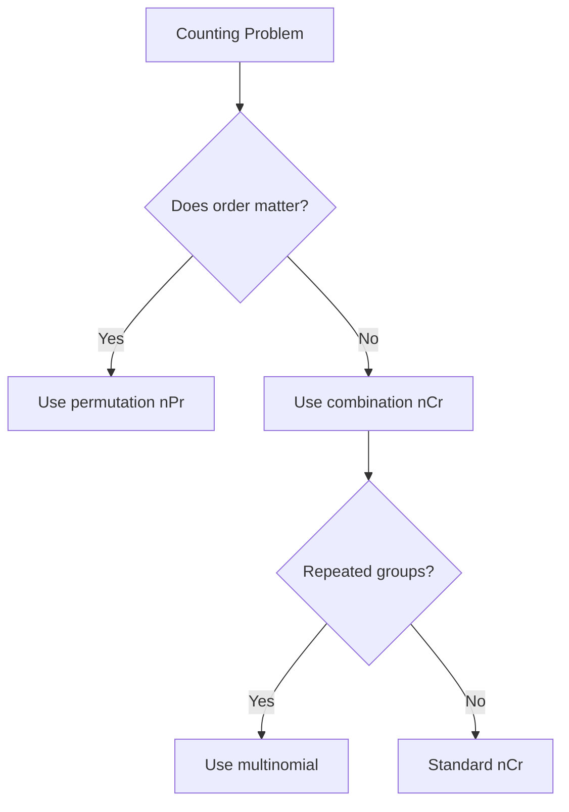

Combinatorics answers: "How many possible outcomes are there?" This is crucial before probability, because
\[
P(E)=\frac{\text{favorable outcomes}}{\text{total outcomes}}
\]
needs correct counting.

## Core formulas

Factorial:
\[
n! = n(n-1)(n-2)\cdots 2\cdot 1
\]

Permutation (order matters):
\[
{}^nP_r = \frac{n!}{(n-r)!}
\]

Combination (order does not matter):
\[
{}^nC_r = \frac{n!}{r!(n-r)!}
\]

Multinomial count:
\[
\frac{n!}{n_1!n_2!\cdots n_k!},\quad \sum n_i=n
\]

## Worked Example 1: permutations

From 8 students, choose president, secretary, treasurer.

\[
{}^8P_3=\frac{8!}{5!}=8\times 7\times 6=336
\]

## Worked Example 2: combinations

Choose 4 lab assistants from 10 candidates:
\[
{}^{10}C_4=\frac{10!}{4!6!}=\frac{10\cdot 9\cdot 8\cdot 7}{4\cdot 3\cdot 2\cdot 1}=210
\]

## Worked Example 3: multinomial

How many arrangements of ENGINEER?
Letters: E appears 3 times, N,G,I,R each once (8 letters total):
\[
\frac{8!}{3!}=\frac{40320}{6}=6720
\]

## Visual decision tree

## Analogy

If combinations are "who comes to the party," permutations are "who sits on which seat."

> **Key Takeaway**
> First decide whether order matters. That one choice prevents most counting mistakes.

> **Exam Tips**
> - Very common trick: students use \({}^nC_r\) when role positions are different.
> - Simplify factorials by cancellation before multiplying.
> - Check repeated items in word-arrangement questions.
