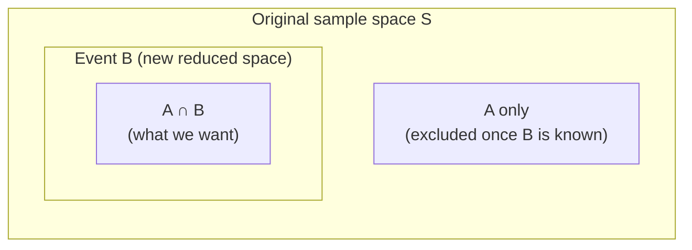

# Conditional Probability and Independence

So far, we have calculated probabilities as if we knew nothing beyond the sample space. But in the real world, you often have **partial information** — you know that some event has already occurred, and this changes what you should predict about other events.

Conditional probability is how you **update** your probability estimates when you learn new information.

---

## Conditional Probability

**Definition:** The **conditional probability of $A$ given $B$** is the probability that event $A$ occurs, given that we already know event $B$ has occurred.

$$\boxed{P(A \mid B) = \frac{P(A \cap B)}{P(B)}, \quad \text{provided } P(B) > 0}$$

**Reading:** $P(A \mid B)$ is read "probability of $A$ given $B$".

### Why This Formula Makes Sense

When we are told $B$ has occurred, the sample space effectively **shrinks** to just the outcomes in $B$. We are no longer considering all of $S$. Within that reduced space, we want to find the proportion that also belongs to $A$ — which is exactly the intersection $A \cap B$ scaled by $P(B)$.

> **Analogy:** Imagine rolling a die. Before any information, $P(\text{even}) = 3/6 = 1/2$. But if someone tells you the result is greater than 3, the possible outcomes shrink to $\{4, 5, 6\}$. Of these, $\{4, 6\}$ are even. So $P(\text{even} \mid \text{greater than 3}) = 2/3$.

### Worked Example 1: Red Car and Speeding Ticket

A survey of 665 drivers produced the following table:

|  | Speeding Ticket | No Ticket | Total |
|--|----------------|-----------|-------|
| **Red car** | 15 | 135 | 150 |
| **Not red car** | 45 | 470 | 515 |
| **Total** | 60 | 605 | 665 |

Find:
(a) $P(\text{Red car and got a ticket})$  
(b) $P(\text{Red car or got a ticket})$  
(c) $P(\text{got a ticket} \mid \text{red car})$  
(d) $P(\text{red car} \mid \text{got a ticket})$

**(a)** $P(\text{Red} \cap \text{Ticket}) = \frac{15}{665} \approx 0.0226$

**(b)** $P(\text{Red} \cup \text{Ticket}) = P(\text{Red}) + P(\text{Ticket}) - P(\text{Red} \cap \text{Ticket})$
$$= \frac{150}{665} + \frac{60}{665} - \frac{15}{665} = \frac{195}{665} \approx 0.293$$

**(c)** Given the car is red, there are 150 red car drivers. Of these, 15 got a ticket.
$$P(\text{Ticket} \mid \text{Red}) = \frac{P(\text{Red} \cap \text{Ticket})}{P(\text{Red})} = \frac{15/665}{150/665} = \frac{15}{150} = 0.10$$

**(d)** Given a ticket was issued (60 total), how many had red cars?
$$P(\text{Red} \mid \text{Ticket}) = \frac{P(\text{Red} \cap \text{Ticket})}{P(\text{Ticket})} = \frac{15/665}{60/665} = \frac{15}{60} = 0.25$$

---

## The Multiplicative Rule of Probability

Rearranging the conditional probability formula:

$$P(A \cap B) = P(B) \cdot P(A \mid B)$$

or equivalently:

$$P(A \cap B) = P(A) \cdot P(B \mid A)$$

This is the **multiplicative rule** — it computes the probability of **both** $A$ and $B$ occurring.

> **Reading:** The probability of $A$ and $B$ both happening equals the probability $B$ happens times the probability $A$ happens **given that $B$ has already happened** (or vice versa).

### Worked Example 2: Drawing Cards Without Replacement

Two cards are drawn from a 52-card deck without replacement. What is the probability that both are aces?

Let $A_1$ = first card is an ace, $A_2$ = second card is an ace.

$$P(A_1 \cap A_2) = P(A_1) \times P(A_2 \mid A_1)$$

- $P(A_1) = \frac{4}{52}$ (4 aces in 52 cards)
- $P(A_2 \mid A_1) = \frac{3}{51}$ (if first was an ace, 3 aces remain in 51 cards)

$$P(\text{two aces}) = \frac{4}{52} \times \frac{3}{51} = \frac{12}{2652} = \frac{1}{221} \approx 0.00452$$

---

## Independent Events

**Definition:** Two events $A$ and $B$ are **independent** if the occurrence of one does **not** affect the probability of the other:

$$\boxed{P(A \mid B) = P(A)}$$

Knowing $B$ occurred gives you no new information about $A$.

**Equivalent definition** (the one more commonly used in calculations):

$$\boxed{P(A \cap B) = P(A) \cdot P(B)}$$

This is derived from $P(A \cap B) = P(B) \cdot P(A \mid B) = P(B) \cdot P(A)$ when $A$ and $B$ are independent.

> **Analogy:** Flipping a fair coin twice. The outcome of the first flip has absolutely no effect on the second. If the first was heads, $P(\text{head on second}) = 1/2$ — exactly as if you knew nothing. These flips are independent.

### Testing for Independence

To check if two events are independent, verify whether $P(A \cap B) = P(A) \times P(B)$.

If they are equal → **independent**.  
If they are not equal → **dependent** (one event affects the other).

### Worked Example 3: Card Draw (Testing for Independence)

From a 52-card deck, one card is drawn. Let:
- $A$ = card is a heart
- $B$ = card is a face card (J, Q, K)

$P(A) = \frac{13}{52} = \frac{1}{4}$, $P(B) = \frac{12}{52} = \frac{3}{13}$

$P(A \cap B) = \frac{3}{52}$ (3 face cards that are hearts)

Check: $P(A) \times P(B) = \frac{1}{4} \times \frac{3}{13} = \frac{3}{52}$

Since $P(A \cap B) = P(A) \times P(B) = \frac{3}{52}$, events $A$ and $B$ are **independent**.

### Important Distinction: Independence vs Mutual Exclusivity

These two concepts are often confused:

| Concept | Meaning | Formula |
|---------|---------|---------|
| **Mutually Exclusive** | Cannot both occur | $P(A \cap B) = 0$ |
| **Independent** | Occurrence of one doesn't change probability of the other | $P(A \cap B) = P(A) \cdot P(B)$ |

If $A$ and $B$ are mutually exclusive and **both have positive probability**, they **cannot** be independent. Because if $A$ occurred, you know with certainty that $B$ did not — $P(B \mid A) = 0 \neq P(B)$.

---

## Bayes' Theorem

**Bayes' Theorem** is one of the most powerful and practically important results in probability. It allows you to **"reverse" conditional probability** — to update what you believe about a cause, given that you observed an effect.

### Setup — The Law of Total Probability

Before Bayes' Theorem, we need the **Law of Total Probability**.

Suppose the sample space $S$ is partitioned into mutually exclusive and exhaustive events $B_1, B_2, \ldots, B_k$ (they cover all of $S$ and don't overlap). Then for any event $A$:

$$P(A) = \sum_{i=1}^{k} P(A \mid B_i) \cdot P(B_i)$$

$$= P(A \mid B_1)P(B_1) + P(A \mid B_2)P(B_2) + \cdots + P(A \mid B_k)P(B_k)$$

> **Analogy:** You are calculating the probability of getting a defective product. You have three machines producing goods. The total probability of defect is the weighted average: probability of defect from Machine 1 × proportion from Machine 1, plus same for Machine 2 and Machine 3.

### Bayes' Theorem

$$\boxed{P(B_i \mid A) = \frac{P(A \mid B_i) \cdot P(B_i)}{\sum_{j=1}^{k} P(A \mid B_j) \cdot P(B_j)}}$$

**Simplified for two events ($B$ and $\bar{B}$):**
$$P(B \mid A) = \frac{P(A \mid B) \cdot P(B)}{P(A \mid B) \cdot P(B) + P(A \mid \bar{B}) \cdot P(\bar{B})}$$

**Terminology:**
- $P(B_i)$ = **prior probability** — what you believe before observing $A$
- $P(A \mid B_i)$ = **likelihood** — how likely is $A$ if $B_i$ is true
- $P(B_i \mid A)$ = **posterior probability** — your updated belief after observing $A$

### Worked Example 4: Medical Diagnostic Test

A disease affects 4% of a population. A diagnostic test for it has:
- **Sensitivity** = 92% (probability of testing positive if you have the disease)
- **Specificity** = 87% (probability of testing negative if you don't have the disease)

A person tests positive. What is the probability they actually have the disease?

**Define events:**
- $D$ = has the disease, $\bar{D}$ = disease-free
- $T^+$ = tests positive

**Given information:**
- $P(D) = 0.04$ (prevalence)
- $P(\bar{D}) = 0.96$
- $P(T^+ \mid D) = 0.92$ (sensitivity)
- $P(T^+ \mid \bar{D}) = 1 - 0.87 = 0.13$ (false positive rate = 1 - specificity)

**Step 1: Find total $P(T^+)$ using the Law of Total Probability:**
$$P(T^+) = P(T^+ \mid D) \cdot P(D) + P(T^+ \mid \bar{D}) \cdot P(\bar{D})$$
$$= (0.92)(0.04) + (0.13)(0.96)$$
$$= 0.0368 + 0.1248 = 0.1616$$

**Step 2: Apply Bayes' Theorem:**
$$P(D \mid T^+) = \frac{P(T^+ \mid D) \cdot P(D)}{P(T^+)} = \frac{(0.92)(0.04)}{0.1616} = \frac{0.0368}{0.1616} \approx 0.228$$

**Interpretation:** Even though the test is quite accurate (92% sensitive, 87% specific), if someone tests positive, there is only a **22.8% chance** they actually have the disease. This seems counterintuitive but makes sense: with only 4% prevalence, most positive tests are false positives because there are so many more disease-free people.

This is called the **Positive Predictive Value (PPV)** of the test.

### Worked Example 5: Factory Machines

A factory has three machines producing bolts:
- Machine 1 (M1): produces 50% of all bolts, 2% defect rate
- Machine 2 (M2): produces 30% of all bolts, 3% defect rate
- Machine 3 (M3): produces 20% of all bolts, 5% defect rate

A bolt is selected and found to be defective. What is the probability it came from Machine 2?

**Step 1: Total probability of defect:**
$$P(\text{Defect}) = P(D \mid M_1)P(M_1) + P(D \mid M_2)P(M_2) + P(D \mid M_3)P(M_3)$$
$$= (0.02)(0.50) + (0.03)(0.30) + (0.05)(0.20)$$
$$= 0.010 + 0.009 + 0.010 = 0.029$$

**Step 2: Bayes' Theorem:**
$$P(M_2 \mid \text{Defect}) = \frac{P(D \mid M_2) \cdot P(M_2)}{P(\text{Defect})} = \frac{(0.03)(0.30)}{0.029} = \frac{0.009}{0.029} \approx 0.310$$

There is a 31% probability the defective bolt came from Machine 2.

---

> **Key Takeaways**
>
> - **Conditional probability:** $P(A \mid B) = \frac{P(A \cap B)}{P(B)}$ — the probability of $A$, given that $B$ has occurred; this restricts the sample space to $B$
> - **Multiplicative rule:** $P(A \cap B) = P(B) \cdot P(A \mid B)$ — find the probability of both $A$ and $B$
> - **Independent events:** $P(A \cap B) = P(A) \cdot P(B)$ — knowing one occurred gives no information about the other
> - **Bayes' Theorem:** updates probabilities from cause → effect direction to effect → cause direction; essential in medical testing, quality control, and machine learning
> - Independent ≠ Mutually exclusive. Mutually exclusive events with positive probability are actually **dependent**.

---

> **Exam Tips**
>
> - **Bayes' Theorem questions at UI** typically involve medical tests (sensitivity, specificity, prevalence) or factory/quality control (machine proportions and defect rates). Set up a table or tree to organise the numbers before applying the formula.
> - **The denominator in Bayes' Theorem** is always the total probability of the observed event, computed via the Law of Total Probability. This is where students make errors — always compute it step by step.
> - **Positive Predictive Value (PPV)** = $P(\text{Disease} \mid \text{Positive test})$ = Bayes' Theorem result. **Negative Predictive Value (NPV)** = $P(\text{No disease} \mid \text{Negative test})$.
> - To check independence, you must show $P(A \cap B) = P(A) \times P(B)$. You cannot show independence just by saying "the events don't affect each other" — you must verify it numerically in an exam.
> - **Conditional probability problems with tables:** when you see a 2×2 contingency table, conditional probabilities are just row or column proportions. $P(A \mid B)$ = count in row $B$ and column $A$ ÷ total count in row $B$.
> - **Drawing without replacement** always creates dependence between draws. Drawing **with replacement** creates independence. Make sure you identify which case applies.
