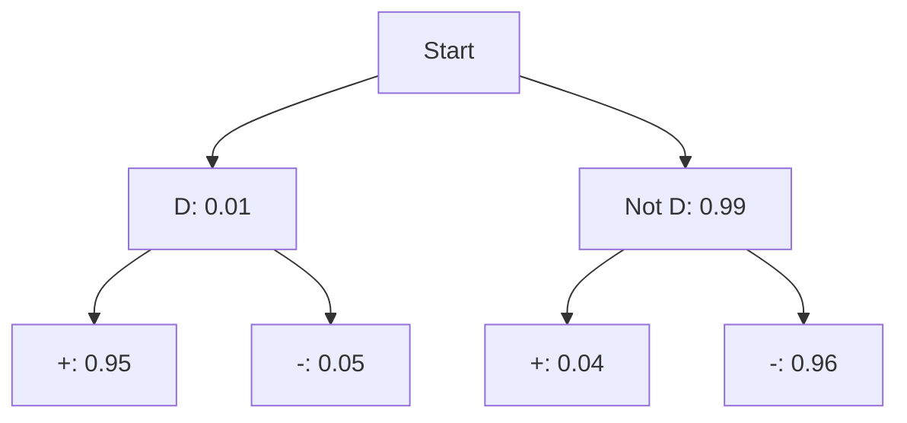

Conditional probability answers: "If I already know event \(B\) happened, how does that change the chance of \(A\)?"

## Core formulas

\[
P(A\mid B)=\frac{P(A\cap B)}{P(B)},\quad P(B)>0
\]

Rearranged multiplication rule:
\[
P(A\cap B)=P(A\mid B)P(B)=P(B\mid A)P(A)
\]

Independent events condition:
\[
A\perp B \iff P(A\mid B)=P(A) \iff P(A\cap B)=P(A)P(B)
\]

Bayes theorem:
\[
P(A\mid B)=\frac{P(B\mid A)P(A)}{P(B)}
\]

## Worked Example 1: conditional probability

Given \(P(A\cap B)=0.18\), \(P(B)=0.30\):
\[
P(A\mid B)=\frac{0.18}{0.30}=0.60
\]
Interpretation: among outcomes where \(B\) occurred, 60% also have \(A\).

## Worked Example 2: independence test

Suppose \(P(A)=0.5\), \(P(B)=0.4\), \(P(A\cap B)=0.2\).
Check:
\[
P(A)P(B)=0.5\times 0.4=0.2 = P(A\cap B)
\]
So the events are independent.

## Worked Example 3: Bayes-style diagnosis

1% of parts are defective: \(P(D)=0.01\).
Test catches defect with 95% sensitivity: \(P(+\mid D)=0.95\).
False positive rate is 4%: \(P(+\mid D^c)=0.04\).

First,
\[
P(+)=P(+\mid D)P(D)+P(+\mid D^c)P(D^c)
=0.95(0.01)+0.04(0.99)=0.0491
\]
Then,
\[
P(D\mid +)=\frac{0.95(0.01)}{0.0491}=0.1935\approx 19.35\%
\]

## Visual: probability tree

## Analogy

If a friend says "traffic is heavy" (event \(B\)), your chance of arriving late (event \(A\)) changes. That updated chance is conditional probability.

> **Key Takeaway**
> Independent events and mutually exclusive events are different ideas. Independence means one event does not change the probability of the other.

> **Exam Tips**
> - Common trap: confusing \(P(A\mid B)\) with \(P(B\mid A)\).
> - Draw a tree for Bayes questions; it prevents algebra mistakes.
> - Always compute \(P(B)\) before applying Bayes.
