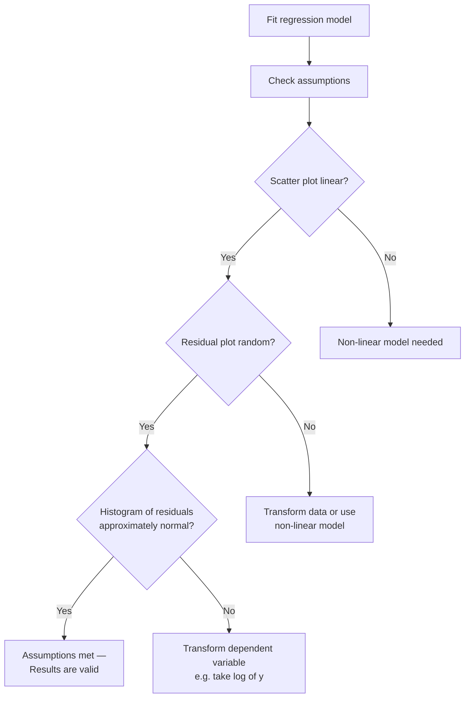

# Correlation and Simple Linear Regression

Knowing a single variable is useful. But in science and engineering, you often want to know: **do two variables move together?** And if they do, **can I use one to predict the other?** Correlation and regression answer these questions quantitatively.

---

## Correlation: Measuring the Relationship

**Correlation** measures the **strength and direction** of the linear relationship between two quantitative variables. The most common measure is **Pearson's correlation coefficient** $r$.

$$\boxed{r = \frac{\sum (x_i - \bar{x})(y_i - \bar{y})}{\sqrt{\sum(x_i - \bar{x})^2 \cdot \sum(y_i - \bar{y})^2}}}$$

Or equivalently using the computational formula:

$$r = \frac{n\sum x_i y_i - \sum x_i \sum y_i}{\sqrt{\left[n\sum x_i^2 - (\sum x_i)^2\right]\left[n\sum y_i^2 - (\sum y_i)^2\right]}}$$

### Properties of $r$

- $-1 \leq r \leq 1$ — always
- $r = 1$: perfect positive linear relationship
- $r = -1$: perfect negative linear relationship
- $r = 0$: no linear relationship (may still have non-linear relationship)
- $r > 0$: as $x$ increases, $y$ tends to increase
- $r < 0$: as $x$ increases, $y$ tends to decrease

### Interpreting the Magnitude of $r$ (Cohen's Guidelines)

| $|r|$ range | Interpretation |
|------------|----------------|
| 0.0 – 0.3 | Weak relationship |
| 0.3 – 0.5 | Moderate relationship |
| 0.5 – 0.9 | Strong relationship |
| 0.9 – 1.0 | Very strong relationship |

> **Critical Warning:** Correlation does **not** imply causation. A strong correlation between two variables could be due to both being caused by a third variable (confounding). A famous example: chocolate consumption per capita correlates strongly with Nobel Prize winners per country ($r = 0.79$). Obviously, chocolate doesn't cause Nobel Prizes — both are influenced by GDP and other factors.

---

## Worked Example 1: Computing Pearson's r

Data: Gestational age (weeks) $x$ and birth weight (lbs) $y$ for 5 babies:

| $x$ (weeks) | $y$ (lbs) | $x - \bar{x}$ | $y - \bar{y}$ | $(x-\bar{x})(y-\bar{y})$ | $(x-\bar{x})^2$ | $(y-\bar{y})^2$ |
|------------|---------|------------|------------|---------------------|--------------|--------------|
| 36 | 5.2 | -2 | -1.56 | 3.12 | 4 | 2.43 |
| 38 | 6.5 | 0 | -0.26 | 0 | 0 | 0.07 |
| 38 | 7.0 | 0 | 0.24 | 0 | 0 | 0.06 |
| 39 | 7.1 | 1 | 0.34 | 0.34 | 1 | 0.12 |
| 39 | 7.5 | 1 | 0.74 | 0.74 | 1 | 0.55 |
| **$\bar{x}=38$** | **$\bar{y}=6.76$** | | | **Sum = 4.20** | **Sum = 6** | **Sum = 3.23** |

$$r = \frac{4.20}{\sqrt{6 \times 3.23}} = \frac{4.20}{\sqrt{19.38}} = \frac{4.20}{4.40} \approx 0.95$$

**Interpretation:** A very strong positive linear relationship between gestational age and birth weight. Longer gestation → heavier baby.

---

## Testing the Significance of $r$

The null hypothesis $H_0: \rho = 0$ (no linear relationship in the population) can be tested:

$$t = \frac{r\sqrt{n-2}}{\sqrt{1-r^2}}$$

with $\nu = n - 2$ degrees of freedom.

If $|t| > t_{crit}$, the correlation is statistically significant.

> **Important:** A statistically significant $r$ does not necessarily mean a strong or practically important relationship — with a very large sample, even $r = 0.05$ can be significant. Always look at both the p-value and the magnitude of $r$.

---

## Simple Linear Regression

Where correlation tells you *whether* two variables are related, **regression** tells you *how* — by fitting a mathematical equation that can be used to predict $y$ from $x$.

Simple linear regression models the relationship between one independent variable ($x$) and one dependent variable ($y$) as a straight line:

$$\boxed{\hat{y} = \hat{\beta}_0 + \hat{\beta}_1 x}$$

Where:
- $\hat{y}$ = predicted value of $y$ (read "y-hat")
- $\hat{\beta}_0$ = estimated y-intercept (value of $\hat{y}$ when $x = 0$)
- $\hat{\beta}_1$ = estimated slope (change in $\hat{y}$ for a 1-unit increase in $x$)
- $x$ = independent (predictor/explanatory) variable

> **Analogy:** Imagine stretching a rubber band taut through a cloud of scattered points. The regression line is the "best fitting" rubber band — positioned to minimise the total distance between the points and the line.

---

## Least Squares Estimation

The regression coefficients are chosen to **minimise the sum of squared residuals**:

$$SSE = \sum_{i=1}^{n} (y_i - \hat{y}_i)^2 = \sum_{i=1}^{n} e_i^2$$

Where $e_i = y_i - \hat{y}_i$ is the **residual** — the difference between the observed value $y_i$ and the predicted value $\hat{y}_i$.

The **least squares formulas** are:

$$\hat{\beta}_1 = \frac{n\sum x_i y_i - \sum x_i \sum y_i}{n\sum x_i^2 - (\sum x_i)^2}$$

$$\hat{\beta}_0 = \bar{y} - \hat{\beta}_1 \bar{x}$$

Note: The numerator of $\hat{\beta}_1$ is the same as in the formula for $r$ — they are closely related.

---

## Worked Example 2: Fitting a Regression Line

Using the gestational age and birth weight data from Example 1:

$n = 5$, $\bar{x} = 38$, $\bar{y} = 6.76$

From the table: $\sum(x_i - \bar{x})(y_i - \bar{y}) = 4.20$, $\sum(x_i - \bar{x})^2 = 6$

$$\hat{\beta}_1 = \frac{4.20}{6} = 0.70$$

$$\hat{\beta}_0 = \bar{y} - \hat{\beta}_1 \bar{x} = 6.76 - 0.70 \times 38 = 6.76 - 26.6 = -19.84$$

**Regression equation:**
$$\hat{y} = -19.84 + 0.70x$$

**Interpretation:** 
- For each additional week of gestation, birth weight increases by approximately **0.70 lbs**.
- At $x = 0$ weeks, the predicted weight is −19.84 lbs — which makes no physical sense. The intercept is only meaningful within the range of the data, not extrapolated.

**Prediction:** For a baby born at 40 weeks:
$$\hat{y} = -19.84 + 0.70 \times 40 = -19.84 + 28 = 8.16 \text{ lbs}$$

---

## The Coefficient of Determination $R^2$

$R^2$ measures the **proportion of variance in $y$ explained by the regression model**:

$$R^2 = r^2 = \frac{SS_{\text{regression}}}{SS_{\text{total}}} = 1 - \frac{SSE}{SS_{\text{total}}}$$

- $R^2 = 0$: the model explains none of the variation in $y$
- $R^2 = 1$: the model explains all variation in $y$ (perfect fit)
- $R^2 = 0.50$: 50% of the variation in $y$ is explained by $x$

From Example 1: $r = 0.95$, so $R^2 = 0.95^2 = 0.90$

**Interpretation:** Gestational age explains **90%** of the variation in birth weight.

---

## Testing the Significance of the Slope

To test $H_0: \beta_1 = 0$ (no linear relationship):

$$t = \frac{\hat{\beta}_1}{SE(\hat{\beta}_1)}$$

with $\nu = n - 2$ degrees of freedom.

If $p < \alpha$, the slope is significantly different from zero — $x$ is a significant predictor of $y$.

From the birth weight example output: $t$ is large, $p < 0.001$, so gestational age is a significant predictor of birth weight.

---

## Assumptions of Linear Regression

The regression model is valid when these assumptions hold:

1. **Linearity:** The true relationship between $x$ and $y$ is linear (check: scatter plot should show a linear pattern)
2. **Independence:** Residuals are independent of each other
3. **Homoscedasticity:** The variance of residuals is constant across all values of $x$ (check: residual plot should show random scatter with no "funnelling")
4. **Normality of residuals:** Residuals are approximately normally distributed (check: histogram of residuals should be roughly bell-shaped)

---

## Confounding and the Correlation Trap

Just because two variables are correlated doesn't mean one causes the other. A **confounding variable** influences both $x$ and $y$, creating a spurious correlation.

Example: Countries with more chocolate consumption have more Nobel Prize winners. This does **not** mean chocolate causes Nobel Prizes. The confounders are GDP and overall standard of living — wealthier countries consume more chocolate AND produce more Nobel Prize winners.

This is why **regression analysis alone cannot establish causation** — it requires careful study design (randomised controlled trials) to do that.

---

> **Key Takeaways**
>
> - **Pearson's $r$** measures the strength and direction of a linear relationship: $-1 \leq r \leq 1$; $r = 0$ means no linear relationship
> - The **regression line** $\hat{y} = \hat{\beta}_0 + \hat{\beta}_1 x$ is found by minimising the sum of squared residuals
> - $\hat{\beta}_1$ = slope: how much $\hat{y}$ changes for each 1-unit increase in $x$
> - $R^2 = r^2$: the proportion of variation in $y$ explained by the model
> - **Correlation ≠ causation**: always consider confounding variables

---

> **Exam Tips**
>
> - To compute $r$ and $\hat{\beta}_1$ quickly, use the computational formula. The same sums ($\Sigma xy$, $\Sigma x$, $\Sigma y$, $\Sigma x^2$, $\Sigma y^2$) appear in both formulas — compute them once and use twice.
> - **$R^2$ is the square of $r$**, not the same as $r$. If $r = 0.8$, $R^2 = 0.64$, not 0.8.
> - The slope interpretation always includes both the **direction** (positive/negative), the **magnitude**, and the **units**: "For each additional cm of height, weight increases by 0.5 kg."
> - **Don't extrapolate** the regression equation beyond the range of $x$ values in your data. Predictions outside the observed range are unreliable.
> - For **checking assumptions**, you need three plots: (1) scatter plot of $x$ vs $y$, (2) scatter plot of predicted values vs residuals (homoscedasticity), (3) histogram of residuals (normality).
