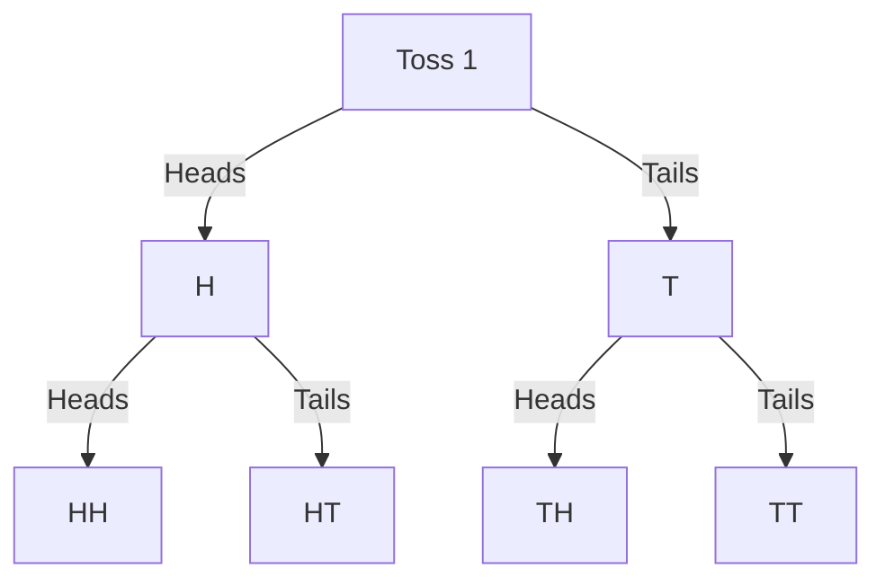

# Counting Techniques

When outcomes are equally likely, probability comes down to counting: how many outcomes are in the event vs how many are in the sample space. The challenge is that sample spaces can be enormous. Counting techniques give you systematic methods to handle this without listing every possibility.

This topic builds on the Combinatorial Methods topic by applying counting directly to probability problems, and introducing tree diagrams, the addition rule for counting, and structured approaches to complex scenarios.

---

## The Finite Uniform Probability Space

Many probability problems fall into this category:
1. There are a **finite number of outcomes**
2. All outcomes are **equally likely**
3. The probability of any event $E$ is:

$$P(E) = \frac{n(E)}{n(S)}$$

Where $n(E)$ = number of outcomes in $E$ and $n(S)$ = total number of outcomes in the sample space.

**The key task:** Correctly count $n(E)$ and $n(S)$.

---

## Rule 1: The Additive Rule for Counting

If sets $A_1, A_2, A_3, \ldots$ are **mutually exclusive** (pairwise disjoint), and $A = A_1 \cup A_2 \cup A_3 \cup \cdots$, then:

$$n(A) = n(A_1) + n(A_2) + n(A_3) + \cdots$$

> **When to use:** When the outcomes you want to count can be partitioned into distinct, non-overlapping groups. Count each group separately and add.

### Worked Example 1: Counting Favourable Outcomes

In a deck of 52 cards, how many cards are either a heart or a face card?

- Hearts: 13 cards
- Face cards that are NOT hearts: 9 (Jack, Queen, King of Spades, Diamonds, Clubs — 3 suits × 3 face cards)
- Heart face cards: 3 (J♥, Q♥, K♥)

Using inclusion-exclusion: $13 + 12 - 3 = 22$ cards.

Or, using the additive rule by splitting into disjoint groups:
- Non-face hearts: 10 (Ace through 10 of hearts)
- Heart face cards: 3
- Non-heart face cards: 9
Total: $10 + 3 + 9 = 22$ ✓

---

## Rule 2: The Multiplicative Rule of Counting

If we carry out $k$ operations **in sequence**, where the $i$-th operation can be done in $n_i$ ways (regardless of previous choices), then the total number of ways is:

$$N = n_1 \times n_2 \times \cdots \times n_k$$

### Worked Example 2: Committee Chair and Vice-Chair

A committee of 10 people needs to elect a chair and a vice-chair. How many ways can this be done?

- Step 1: Choose the chair — 10 ways
- Step 2: Choose the vice-chair (cannot be the same person) — 9 ways

$$N = 10 \times 9 = 90$$

### Worked Example 3: Blackjack

In Blackjack, you are dealt 2 cards from a 52-card deck. What is the probability of getting a "21" (Ace + a face card or 10)?

**Total ways to receive 2 cards in order:**
$$n(S) = 52 \times 51 = 2652$$

**Favourable outcomes:** A "21" requires:
- First card is an Ace (4 aces), second card is {10, J, Q, K} (16 cards) → $4 \times 16 = 64$ ways
- First card is {10, J, Q, K} (16 cards), second card is an Ace (4 aces) → $16 \times 4 = 64$ ways

$$n(E) = 64 + 64 = 128$$

$$P(\text{21}) = \frac{128}{2652} = \frac{32}{663} \approx 0.0483$$

---

## Permutations: Order Matters

A **permutation** selects $r$ objects from $n$ in a specific order. Each different ordering is a different outcome.

**Ordering all $n$ objects:** $n!$

**Choosing and ordering $r$ from $n$:**
$$P(n, r) = \frac{n!}{(n-r)!}$$

### Worked Example 4: Race Rankings

8 horses are in a race. How many different orderings of 1st, 2nd, and 3rd place are there?

$$P(8, 3) = \frac{8!}{(8-3)!} = \frac{8!}{5!} = 8 \times 7 \times 6 = 336$$

### Worked Example 5: Probability with Permutations

From a group of 10 people (6 male, 4 female), 3 people are randomly chosen for 1st, 2nd, and 3rd prize. What is the probability that all three prizes go to males?

$$n(S) = P(10, 3) = \frac{10!}{7!} = 10 \times 9 \times 8 = 720$$

$$n(\text{all male}) = P(6, 3) = \frac{6!}{3!} = 6 \times 5 \times 4 = 120$$

$$P(\text{all male}) = \frac{120}{720} = \frac{1}{6}$$

---

## Combinations: Order Does Not Matter

A **combination** selects $r$ objects from $n$ where the order of selection is irrelevant.

$$C(n, r) = \binom{n}{r} = \frac{n!}{r!(n-r)!}$$

Note: $C(n, r) = \frac{P(n,r)}{r!}$ — you divide by $r!$ because combinations don't distinguish between different orderings of the same subset.

### Worked Example 6: Committee Selection

From 10 people (6 male, 4 female), a committee of 3 is chosen randomly (no roles). What is the probability all are male?

$$n(S) = C(10, 3) = \frac{10!}{3! \times 7!} = 120$$

$$n(\text{all male}) = C(6, 3) = \frac{6!}{3! \times 3!} = 20$$

$$P(\text{all male}) = \frac{20}{120} = \frac{1}{6}$$

*Note: Same answer as Worked Example 5, because whether we assign roles or not doesn't change who is selected.*

### Worked Example 7: Mixed Gender Committee

From 10 people (6 male, 4 female), 4 people are chosen for a team. What is the probability of exactly 2 males and 2 females?

$$n(S) = C(10, 4) = \frac{10!}{4! \times 6!} = 210$$

$$n(\text{2M, 2F}) = C(6, 2) \times C(4, 2) = 15 \times 6 = 90$$

Why multiply? We must choose 2 males from 6 **and** 2 females from 4, and these selections are independent — the Multiplication Principle applies.

$$P(\text{2M, 2F}) = \frac{90}{210} = \frac{3}{7} \approx 0.429$$

---

## Counting with Restrictions

Some problems have constraints. The strategy is usually: **count the restricted group first, then fill the rest**.

### Worked Example 8: Selecting with a Required Member

From a committee of 14 people including a captain, we need to select a team of 11.

**(a) How many teams include the captain?**

If the captain must be on the team, he takes one of the 11 spots automatically. We choose the remaining 10 from the other 13 people.

$$n = C(13, 10) = C(13, 3) = \frac{13!}{3! \times 10!} = \frac{13 \times 12 \times 11}{6} = 286$$

**(b) How many teams do NOT include the captain?**

The captain is excluded. Choose all 11 from the remaining 13.

$$n = C(13, 11) = C(13, 2) = \frac{13 \times 12}{2} = 78$$

**Verification:** Total teams $= C(14, 11) = C(14, 3) = \frac{14 \times 13 \times 12}{6} = 364$

$286 + 78 = 364$ ✓

---

## Tree Diagrams for Small Problems

When the sample space is small, a **tree diagram** provides a visual, systematic enumeration of all outcomes.

### Worked Example 9: Two Coin Tosses

Sample space: $\{HH, HT, TH, TT\}$, $n(S) = 4$

$P(\text{exactly one Head}) = \frac{n(\{HT, TH\})}{4} = \frac{2}{4} = \frac{1}{2}$

---

## Distinguishable Arrangements (Permutations with Repetition)

When objects of the same type are present, many orderings are identical. The number of **distinguishable** arrangements of $n$ objects where $n_1$ are of type 1, $n_2$ of type 2, ..., $n_k$ of type $k$:

$$N = \frac{n!}{n_1! \times n_2! \times \cdots \times n_k!}$$

### Worked Example 10: Signal Flags

How many distinct signals can be made using 3 red flags, 2 blue flags, and 1 green flag, displayed in a vertical line?

Total flags: $n = 3 + 2 + 1 = 6$

$$N = \frac{6!}{3! \times 2! \times 1!} = \frac{720}{6 \times 2 \times 1} = 60 \text{ distinct signals}$$

---

> **Key Takeaways**
>
> - **Equal-likelihood assumption:** $P(E) = n(E)/n(S)$ — the entire calculation reduces to counting correctly
> - **Additive rule for counting:** mutually exclusive groups can be counted separately and added
> - **Multiplicative rule:** for sequential independent choices, multiply the options at each step
> - **Permutation** $P(n,r) = \frac{n!}{(n-r)!}$: when order matters. **Combination** $C(n,r) = \frac{n!}{r!(n-r)!}$: when order doesn't matter
> - For restrictions (must include/exclude certain items), handle the restricted element first, then count the rest

---

> **Exam Tips**
>
> - **Identify the question type first:** Does the problem ask about arrangements/orderings (order matters → permutation) or selections/groups (order doesn't matter → combination)?
> - **Common counting probability structure:** $P(E) = \frac{C(\text{favourable selections})}{C(\text{total selections})}$ — most exam problems use combinations in both numerator and denominator.
> - **When the problem has multiple conditions** (e.g., exactly 2 males AND 2 females), use the multiplication principle: $C(m, 2) \times C(f, 2)$ in the numerator.
> - **Verify with complementary counting when appropriate:** Sometimes $P(\text{event}) = 1 - P(\text{complement event})$ is far simpler than direct counting.
> - A common question format: "In how many ways can a group of $n$ be arranged/selected such that [condition]?" — always check if the condition reduces the problem to a simpler permutation/combination calculation.
