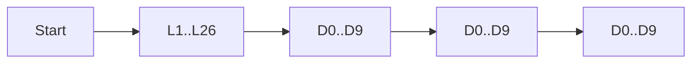

Counting techniques are the bridge between real scenarios and probability formulas.

## Product rule

If step 1 has \(m\) choices and step 2 has \(n\) choices, total outcomes:
\[
m\times n
\]
For many steps:
\[
\prod_{i=1}^{k} n_i
\]

## Worked Example 1: password count

A code has 2 letters then 3 digits.
Letters: 26 each, digits: 10 each.
\[
N=26\cdot 26\cdot 10\cdot 10\cdot 10=676000
\]

## Worked Example 2: committee with constraints

Choose 1 captain from 5 seniors and 2 members from 8 juniors.
\[
N = {}^5C_1\cdot {}^8C_2 = 5\cdot 28=140
\]

## Worked Example 3: at least one success

Three independent tests, pass probability per test \(0.7\).
Probability of at least one pass:
\[
1-P(\text{none}) = 1-(0.3)^3=1-0.027=0.973
\]

## Visual: tree model

## Analogy

Outfit counting: shirts \(\times\) trousers \(\times\) shoes = total looks.

> **Key Takeaway**
> Break big scenarios into stages and multiply stage counts.

> **Exam Tips**
> - Watch words like "without replacement" (choices reduce each step).
> - "At least one" is usually easiest through complement.
> - For mixed constraints, split into independent sub-selections then multiply.
