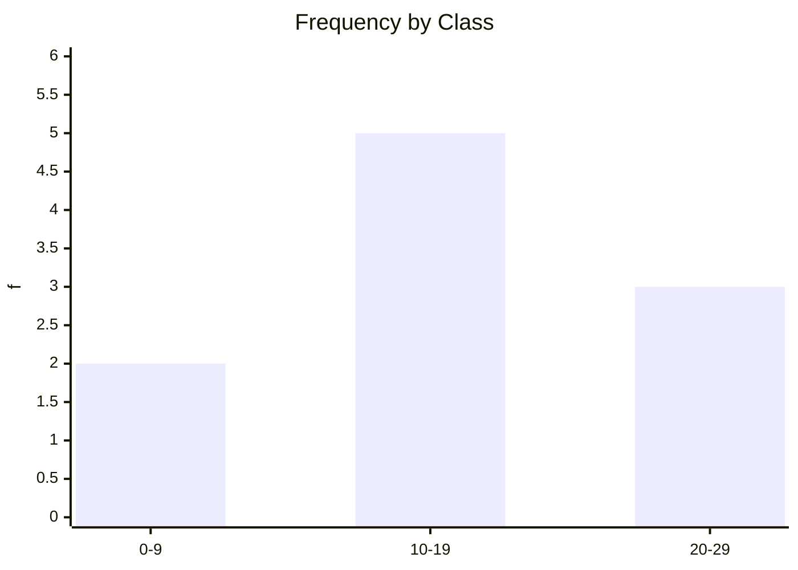

Descriptive statistics turns raw numbers into understandable summaries. In STA 202, this is where you learn to compute and interpret central tendency correctly.

## Main measures

- Mean: \(\bar{x}=\frac{\sum x_i}{n}\)
- Median: middle value after sorting
- Mode: most frequent value

## Order of operations reminder

For expressions: parentheses, powers, multiply/divide, add/subtract.

\[
2 + 3\times 4^2 = 2 + 3\times 16 = 2 + 48 = 50
\]

## Worked Example 1: ungrouped data

Data: \(4,6,8,8,10,12\)

Mean:
\[
\bar{x}=\frac{4+6+8+8+10+12}{6}=\frac{48}{6}=8
\]

Median: sorted already, middle two are 8 and 8:
\[
\text{Median}=\frac{8+8}{2}=8
\]

Mode: 8 appears most \(\Rightarrow\) mode = 8.

## Worked Example 2: grouped data mean

| Class | Frequency \(f\) | Midpoint \(m\) | \(fm\) |
|---|---:|---:|---:|
| 0–9 | 2 | 4.5 | 9 |
| 10–19 | 5 | 14.5 | 72.5 |
| 20–29 | 3 | 24.5 | 73.5 |

\[
\sum f = 10,\quad \sum fm = 155
\]

Grouped mean:
\[
\bar{x}=\frac{\sum fm}{\sum f}=\frac{155}{10}=15.5
\]

## Visual (mermaid): frequency bar sketch

## Analogy

Descriptive statistics is like compressing a long movie into a trailer: you keep the important pattern without replaying every second.

> **Key Takeaway**
> Compute carefully: structure your table, apply formulas, and follow arithmetic order strictly.

> **Exam Tips**
> - Expect "find mean/median/mode" for grouped and ungrouped data.
> - Common mistake: wrong class midpoint \(m=\frac{L+U}{2}\).
> - In MCQs, check whether data are sorted before taking median.
