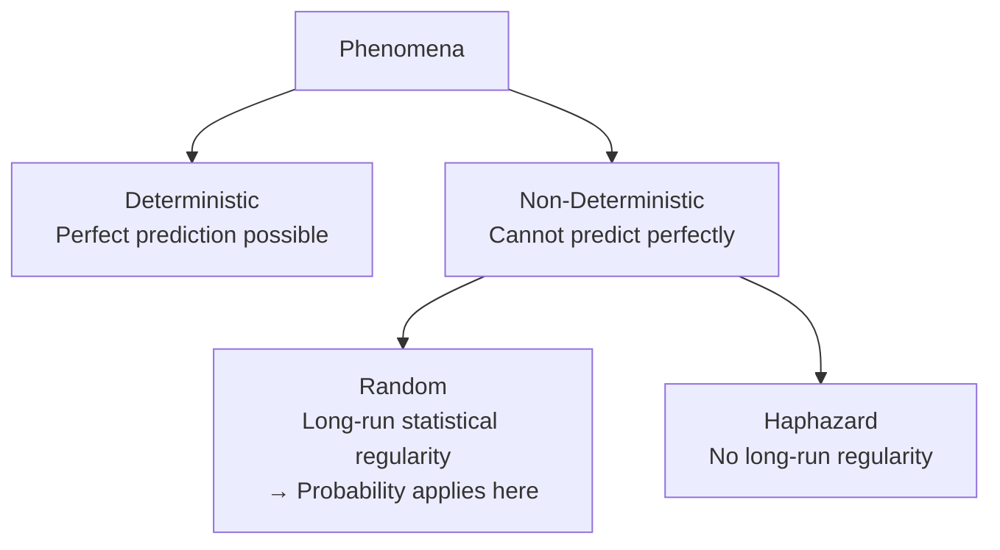
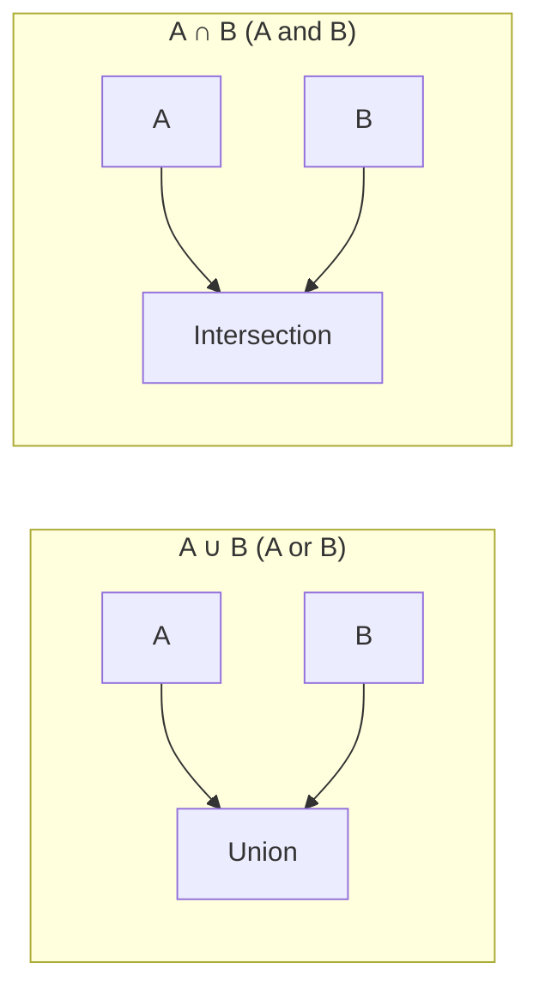

# Elements of Probability

Probability is the mathematical language of uncertainty. It lets you say, with precision, how likely something is to happen — even when you cannot predict the exact outcome. Before you can calculate probabilities, you need to understand the foundational vocabulary and concepts that the entire field is built on.

---

## Deterministic vs Non-Deterministic Phenomena

Not all phenomena behave the same way. The world divides into two types:

### Deterministic Phenomena
There exists a mathematical model that allows **perfect prediction** of the outcome. Given the inputs, you always know the output exactly.

- Examples: Ohm's Law ($V = IR$), projectile motion, chemical equations with exact stoichiometry
- If you know the voltage and resistance, you know the current exactly — always.

### Non-Deterministic (Stochastic) Phenomena
No mathematical model can perfectly predict the outcome in advance.

These split further into two sub-types:

**1. Random Phenomena:** Outcomes are unpredictable individually, but they **exhibit statistical regularity in the long run**. This is the key — pattern emerges over many trials.

- Tossing a coin: you cannot predict a single toss. But over 1,000 tosses, you reliably get close to 500 heads. The long-run proportion is predictable.
- Rolling a die: any single roll is unknown, but each face appears about 1/6 of the time in the long run.

**2. Haphazard Phenomena:** Unpredictable outcomes with **no long-run statistical regularity**. These are so chaotic they cannot be modelled. (Whether truly haphazard phenomena exist in nature is a philosophical question — for this course, we focus on random phenomena.)

> **Analogy:** Weather is non-deterministic. Predicting whether it will rain on a specific day is hard. But saying "it rains about 30% of days in June in this city" is a probabilistic statement about long-run regularity — that is statistics in action.

---

## The Sample Space

**Definition:** The **sample space** $S$ for a random phenomenon is the set of **all possible outcomes**.

The sample space is the universe of everything that could happen in a single trial of the experiment. To define probability, you must first define the sample space.

### Examples of Sample Spaces

| Experiment | Sample Space $S$ |
|-----------|-----------------|
| Tossing a coin | $S = \{\text{Head}, \text{Tail}\}$ |
| Rolling a die | $S = \{1, 2, 3, 4, 5, 6\}$ |
| Drawing a card from a deck | $S = \{$all 52 cards$\}$ |
| Measuring a temperature (°C) | $S = (-\infty, +\infty)$ (continuous) |
| Number of defects in a batch | $S = \{0, 1, 2, 3, \ldots\}$ |

---

## Events

**Definition:** An **event** $E$ is any **subset** of the sample space $S$ — any collection of outcomes (not necessarily all of them).

- The **event occurs** if the observed outcome falls inside $E$
- The **event does not occur** if the observed outcome falls outside $E$

### Special Events

**The Null Event (Empty Event):** $\emptyset = \{\}$ — the event with no outcomes. It **never occurs**.

**The Entire Event (Sample Space):** $S$ — the event containing all outcomes. It **always occurs**.

### Set Operations on Events

Since events are sets, all set operations apply. These operations have direct probability meaning:

#### Union: $A \cup B$ ("A or B")
$$A \cup B = \{e \mid e \in A \text{ or } e \in B\}$$

The union occurs if **at least one** of $A$ or $B$ occurs. In problems, the word "**or**" signals union.

#### Intersection: $A \cap B$ ("A and B")
$$A \cap B = \{e \mid e \in A \text{ and } e \in B\}$$

The intersection occurs if **both** $A$ and $B$ occur simultaneously. In problems, the word "**and**" signals intersection.

#### Complement: $\bar{A}$ or $A^c$ ("Not A")
$$\bar{A} = \{e \mid e \notin A\}$$

The complement occurs if $A$ does **not** occur. In problems, the word "**not**" signals complement.

### Worked Example 1: Events from Rolling a Die

Sample space: $S = \{1, 2, 3, 4, 5, 6\}$

Let:
- $A$ = event that an **even** number is rolled = $\{2, 4, 6\}$
- $B$ = event that a number **greater than 3** is rolled = $\{4, 5, 6\}$

**Union:** $A \cup B$ = even or greater than 3:
$$A \cup B = \{2, 4, 5, 6\}$$

**Intersection:** $A \cap B$ = even and greater than 3:
$$A \cap B = \{4, 6\}$$

**Complement of A:** $\bar{A}$ = not even (i.e., odd):
$$\bar{A} = \{1, 3, 5\}$$

---

## Mutually Exclusive Events

**Definition:** Two events $A$ and $B$ are **mutually exclusive** (or disjoint) if they have no outcomes in common:
$$A \cap B = \emptyset$$

When $A$ and $B$ are mutually exclusive:
- They **cannot both occur** in the same trial
- Knowing one occurred tells you the other definitely did not

> **Examples:**
> - Rolling an even number vs rolling an odd number — these are mutually exclusive (a number can't be both)
> - Getting heads vs getting tails on a single coin toss — mutually exclusive

> **Non-examples:**
> - Rolling a 4 and rolling an even number — **not** mutually exclusive (4 is even, so both occur simultaneously)
> - Drawing a heart and drawing a face card — not mutually exclusive (Jack of Hearts is both)

---

## Classical Definition of Probability

When the sample space has a **finite number of equally likely outcomes**, the probability of an event $E$ is:

$$P(E) = \frac{n(E)}{n(S)} = \frac{\text{number of outcomes in } E}{\text{total number of outcomes in } S}$$

Where $n(A)$ denotes the number of elements in set $A$.

**Important:** This definition **only works** when:
1. The sample space is finite (countable number of outcomes), and
2. All outcomes are equally probable (equally likely)

If either condition fails, a more general definition of probability is needed (developed in subsequent topics).

### Properties of Probability

1. $0 \leq P(E) \leq 1$ for every event $E$
2. $P(S) = 1$ (the sample space always occurs)
3. $P(\emptyset) = 0$ (the null event never occurs)

### Worked Example 2: Drawing Cards

A card is drawn at random from a standard 52-card deck. What is the probability of drawing a king?

There are 4 kings in the deck. All 52 cards are equally likely.

$$P(\text{King}) = \frac{n(\text{King})}{n(S)} = \frac{4}{52} = \frac{1}{13} \approx 0.077$$

### Worked Example 3: Rolling a Die

A fair die is rolled. What is the probability of rolling:
(a) A 3
(b) An even number
(c) A number less than 5

$S = \{1, 2, 3, 4, 5, 6\}$, so $n(S) = 6$.

(a) $P(3) = \frac{1}{6}$

(b) Even numbers: $\{2, 4, 6\}$, so $n = 3$.
$$P(\text{even}) = \frac{3}{6} = \frac{1}{2}$$

(c) Numbers less than 5: $\{1, 2, 3, 4\}$, so $n = 4$.
$$P(X < 5) = \frac{4}{6} = \frac{2}{3}$$

### Worked Example 4: Committee Problem

A committee of 10 people has 6 males and 4 females. Three people are randomly chosen. What is the probability that all three are male?

**Total ways to choose 3 from 10:**
$$n(S) = C(10, 3) = \frac{10!}{3! \times 7!} = 120$$

**Ways to choose 3 males from 6:**
$$n(\text{all male}) = C(6, 3) = \frac{6!}{3! \times 3!} = 20$$

**Probability:**
$$P(\text{all male}) = \frac{20}{120} = \frac{1}{6}$$

---

> **Key Takeaways**
>
> - **Random phenomena** are unpredictable individually but show **statistical regularity in the long run** — this is what makes probability meaningful
> - The **sample space** $S$ is the complete list of all possible outcomes for an experiment
> - An **event** is any subset of the sample space. Union = "or"; Intersection = "and"; Complement = "not"
> - **Mutually exclusive events** cannot occur simultaneously: $A \cap B = \emptyset$
> - **Classical probability**: $P(E) = \frac{n(E)}{n(S)}$ — only valid when outcomes are equally likely
> - All probabilities are between 0 and 1; $P(S) = 1$; $P(\emptyset) = 0$

---

> **Exam Tips**
>
> - **Recognise set operations from keywords in the problem:** "or" → union, "and" → intersection, "not" → complement. Getting this wrong is one of the most common errors.
> - **Mutually exclusive vs Independent** is a very common MCQ trap. Mutually exclusive means $A \cap B = \emptyset$ (they can't both happen). Independent (covered in the next topic) means $P(A \cap B) = P(A)P(B)$ (knowing one doesn't affect the other). These are different concepts — in fact, mutually exclusive events are **not** independent (unless one has probability 0).
> - When using the classical formula, always confirm the outcomes are equally likely. A biased coin does not have equally likely outcomes, so $P(\text{Head}) \neq \frac{1}{2}$.
> - For problems involving card draws, committee selections, or any situation with multiple items chosen, use combinations ($C(n,r)$) in the probability formula: $P(E) = \frac{C(\text{favourable})}{C(\text{total})}$.
> - Listing the full sample space is helpful for small problems. For a coin tossed 3 times: $S = \{HHH, HHT, HTH, HTT, THH, THT, TTH, TTT\}$ has $2^3 = 8$ elements.
