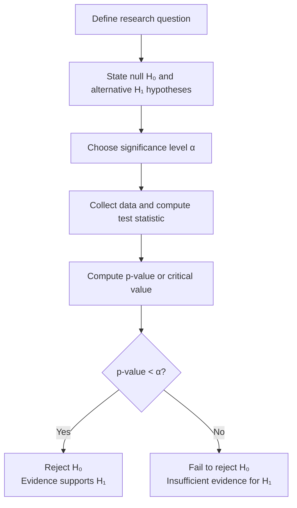

# Hypothesis Testing

Every day, researchers, engineers, and doctors make decisions based on data. "Is this new drug more effective than the existing one?" "Has the machine's precision changed after maintenance?" "Is there a link between smoking and lung disease?" Hypothesis testing is the statistical framework for answering these yes/no questions rigorously, using data rather than guesswork.

---

## The Core Idea

Here is the fundamental logic of hypothesis testing: you assume the boring, default situation is true (called the null hypothesis), collect data, and then ask: "If the null hypothesis were really true, how surprising would this data be?" If the data is extremely surprising under that assumption, you reject the null hypothesis in favour of an alternative.

---

## Step 1: Setting Up Hypotheses

**The Null Hypothesis ($H_0$):** The default position — usually "no effect", "no difference", or "status quo". It contains an equality ($=$, $\leq$, or $\geq$).

**The Alternative Hypothesis ($H_1$ or $H_a$):** The claim you are trying to find evidence for. It contains a strict inequality ($\neq$, $<$, or $>$).

You **never prove** $H_0$ — you either reject it or fail to reject it. Failing to reject $H_0$ does not mean $H_0$ is true; it just means the evidence wasn't strong enough to overturn it.

### Types of Tests

| $H_1$ Direction | Test Type | Rejection Region |
|----------------|-----------|-----------------|
| $H_1: \mu \neq \mu_0$ | **Two-tailed** | Both extreme ends of the distribution |
| $H_1: \mu > \mu_0$ | **Right-tailed** (upper) | Right tail |
| $H_1: \mu < \mu_0$ | **Left-tailed** (lower) | Left tail |

> **Analogy:** The legal system mirrors hypothesis testing. The null hypothesis is "the defendant is innocent." You collect evidence (data). If the evidence is overwhelmingly inconsistent with innocence, you reject it and convict. If the evidence is insufficient, you don't convict — but this doesn't prove the person is innocent.

---

## Step 2: Significance Level and Type I/II Errors

**Significance level $\alpha$:** The maximum probability of rejecting $H_0$ when $H_0$ is actually true. Commonly $\alpha = 0.05$ (5%) or $\alpha = 0.01$ (1%).

There are two types of decision errors:

| | $H_0$ is True | $H_0$ is False |
|-|--------------|----------------|
| **Reject $H_0$** | **Type I Error** (False Positive) Probability = $\alpha$ | Correct Decision Probability = $1 - \beta$ (Power) |
| **Fail to reject $H_0$** | Correct Decision Probability = $1 - \alpha$ | **Type II Error** (False Negative) Probability = $\beta$ |

- **Type I Error:** You reject $H_0$ when it's actually true. You cry wolf when there's no wolf.
- **Type II Error:** You fail to reject $H_0$ when it's actually false. You miss the real wolf.

---

## The t-Test: Comparing Means

The **t-test** is the workhorse of hypothesis testing for means. It is used when:
- The population standard deviation $\sigma$ is **unknown** (we use the sample SD $s$ instead)
- The sample size is small, or
- The data is approximately normally distributed

The **t-distribution** is similar to the standard normal but with heavier tails, which accounts for the extra uncertainty from estimating $\sigma$ with $s$. As degrees of freedom $\nu \to \infty$, the t-distribution approaches the standard normal.

---

## One-Sample t-Test

**Purpose:** Test whether the population mean equals a specific value $\mu_0$.

**Hypotheses:** $H_0: \mu = \mu_0$ vs $H_1: \mu \neq \mu_0$ (or one-sided alternatives)

**Test Statistic:**
$$t = \frac{\bar{x} - \mu_0}{s/\sqrt{n}}$$

Where:
- $\bar{x}$ = sample mean
- $\mu_0$ = hypothesised population mean
- $s$ = sample standard deviation
- $n$ = sample size
- Degrees of freedom: $\nu = n - 1$

### Worked Example 1: One-Sample t-Test

A manufacturer claims their batteries have a mean lifespan of 500 hours. A consumer group tests 16 batteries and finds $\bar{x} = 490$ hours with $s = 20$ hours. Test at $\alpha = 0.05$.

**$H_0: \mu = 500$ vs $H_1: \mu \neq 500$ (two-tailed)**

**Test statistic:**
$$t = \frac{490 - 500}{20/\sqrt{16}} = \frac{-10}{5} = -2.00$$

**Critical value:** For two-tailed test, $\alpha = 0.05$, $\nu = 15$: $t_{crit} = \pm 2.131$

**Decision:** $|t| = 2.00 < 2.131$, so we **fail to reject $H_0$**.

**Conclusion:** At 5% significance, there is insufficient evidence that the mean lifespan differs from 500 hours.

---

## Paired t-Test

**Purpose:** Compare two related measurements on the **same subjects** (before-and-after, matched pairs).

**Setup:** Compute the difference $d_i = x_{1i} - x_{2i}$ for each pair. Then test whether the mean difference is zero.

**Test Statistic:**
$$t = \frac{\bar{d}}{s_d / \sqrt{n}}$$

Where $\bar{d}$ = mean of differences, $s_d$ = standard deviation of differences, $\nu = n - 1$.

### Worked Example 2: Paired t-Test

Triglyceride levels (mg/dl) were measured for 35 patients before and after 8 weeks of treatment. The differences had $\bar{d} = -11.371$ and $s_d = 80.360$.

**$H_0: \mu_d = 0$ vs $H_1: \mu_d \neq 0$**

$$t = \frac{-11.371}{80.360/\sqrt{35}} = \frac{-11.371}{13.583} = -0.837$$

**Degrees of freedom:** $\nu = 34$. From t-table (two-tailed, $\alpha = 0.05$): $t_{crit} \approx 2.032$.

**Decision:** $|t| = 0.837 < 2.032$. Fail to reject $H_0$.

**p-value** = 0.408 (given). Since $0.408 > 0.05$, there is no significant evidence of a difference in triglyceride levels.

---

## Independent Samples t-Test

**Purpose:** Compare means of **two independent groups**.

**Test Statistic (assuming equal variances):**
$$t = \frac{\bar{x}_1 - \bar{x}_2}{s_p\sqrt{\frac{1}{n_1} + \frac{1}{n_2}}}$$

Where $s_p$ = pooled standard deviation:
$$s_p = \sqrt{\frac{(n_1 - 1)s_1^2 + (n_2 - 1)s_2^2}{n_1 + n_2 - 2}}$$

**Degrees of freedom:** $\nu = n_1 + n_2 - 2$

**Check for equal variances:** Use Levene's test. If the test is not significant ($p > 0.05$), assume equal variances.

### Worked Example 3: Independent Samples t-Test

Comparing weight loss (kg) between a new drug ($n_1 = 18$, $\bar{x}_1 = 5.01$, $s_1 = 2.722$) and placebo ($n_2 = 19$, $\bar{x}_2 = 1.36$, $s_2 = 2.148$). $\alpha = 0.05$.

$H_0: \mu_{\text{drug}} = \mu_{\text{placebo}}$ vs $H_1: \mu_{\text{drug}} \neq \mu_{\text{placebo}}$

Levene's test: $p = 0.136 > 0.05$ — equal variances assumed.

**Pooled SD:**
$$s_p = \sqrt{\frac{17(2.722)^2 + 18(2.148)^2}{35}} = \sqrt{\frac{17(7.409) + 18(4.614)}{35}} = \sqrt{\frac{125.95 + 83.05}{35}} = \sqrt{5.971} \approx 2.444$$

**Test statistic:**
$$t = \frac{5.01 - 1.36}{2.444\sqrt{1/18 + 1/19}} = \frac{3.65}{2.444 \times 0.328} = \frac{3.65}{0.802} \approx 4.55$$

From the output: $t = 4.539$, $\nu = 35$, $p = 0.000 < 0.05$.

**Reject $H_0$** — there is strong evidence that the new drug produces significantly more weight loss.

---

## Chi-Square Test of Independence

**Purpose:** Test whether two **categorical variables** are associated (related) or independent.

**Setup:** Data is arranged in a contingency table. Expected frequencies are computed under the assumption of independence.

**Test Statistic:**
$$\chi^2 = \sum_{\text{all cells}} \frac{(O - E)^2}{E}$$

Where:
- $O$ = observed frequency in each cell
- $E$ = expected frequency if the variables were independent: $E = \frac{(\text{row total}) \times (\text{column total})}{\text{grand total}}$
- Degrees of freedom: $\nu = (r-1)(c-1)$ where $r$ = rows, $c$ = columns

**Assumptions:** All expected frequencies $\geq 5$ (if not, combine categories).

### Worked Example 4: Chi-Square Test of Independence (Titanic)

Data from the Titanic (1309 passengers):

| | Died | Survived | Total |
|--|------|----------|-------|
| 1st Class | 200 | 123 | 323 |
| 2nd Class | 171 | 106 | 277 |
| 3rd Class | 438 | 271 | 709 |
| **Total** | **809** | **500** | **1309** |

**$H_0$:** No association between passenger class and survival.  
**$H_1$:** There is an association.

**Expected frequencies** ($E = \frac{\text{row} \times \text{col}}{\text{total}}$):

| | Died (E) | Survived (E) |
|--|---------|------------|
| 1st Class | $\frac{323 \times 809}{1309} = 199.7$ | $\frac{323 \times 500}{1309} = 123.3$ |
| 2nd Class | $\frac{277 \times 809}{1309} = 171.3$ | $105.7$ |
| 3rd Class | $\frac{709 \times 809}{1309} = 438.1$ | $271.0$ |

**Test statistic:**
All expected values are close to observed values, giving a small $\chi^2$... Actually, in this Titanic dataset the proportions of death (61.8%) are nearly equal across classes, suggesting class did **not** significantly affect survival (this famous dataset is being used to illustrate the test structure).

$\nu = (3-1)(2-1) = 2$, critical value at $\alpha = 0.05$: $\chi^2_{crit} = 5.991$.

---

## Chi-Square Goodness of Fit Test

**Purpose:** Test whether observed data follows a particular theoretical distribution.

$$\chi^2 = \sum_{i=1}^{k} \frac{(O_i - E_i)^2}{E_i}$$

$\nu = k - 1$ (minus any parameters estimated from data).

### Worked Example 5: Goodness of Fit

A survey of 400 patients in 4 northern Nigerian states found: Borno (138), Sokoto (97), Zamfara (89), Plateau (76). 

The Nigeria NTD Master Plan projects cases distributed in ratio **4:3:2:1** across these states. Test at 5% significance.

**Expected (out of 400 total):**
$$E_1 = 400 \times \frac{4}{10} = 160, \quad E_2 = 400 \times \frac{3}{10} = 120$$
$$E_3 = 400 \times \frac{2}{10} = 80, \quad E_4 = 400 \times \frac{1}{10} = 40$$

**Test statistic:**
$$\chi^2 = \frac{(138-160)^2}{160} + \frac{(97-120)^2}{120} + \frac{(89-80)^2}{80} + \frac{(76-40)^2}{40}$$

$$= \frac{484}{160} + \frac{529}{120} + \frac{81}{80} + \frac{1296}{40}$$

$$= 3.025 + 4.408 + 1.013 + 32.4 = 40.846$$

**Critical value:** $\nu = 4 - 1 = 3$, $\chi^2_{crit}(0.05, 3) = 7.815$

Since $40.846 > 7.815$, **reject $H_0$**. The observed distribution is not consistent with the projected 4:3:2:1 ratio.

---

> **Key Takeaways**
>
> - Hypothesis testing has a standard flow: set $H_0$ and $H_1$ → choose $\alpha$ → compute test statistic → find p-value or critical value → decide
> - **p-value:** the probability of observing a test statistic at least as extreme as ours, assuming $H_0$ is true. If $p < \alpha$, reject $H_0$.
> - **Type I error ($\alpha$):** rejecting a true $H_0$. **Type II error ($\beta$):** failing to reject a false $H_0$.
> - **Paired t-test:** two measurements on the same subjects (use differences). **Independent t-test:** two separate groups.
> - **Chi-square test:** for categorical data — independence of two variables, or goodness of fit to a distribution.

---

> **Exam Tips**
>
> - Always **state your hypotheses clearly and mathematically** before computing anything. Marks are allocated for the setup.
> - **Paired vs independent t-test:** The question will state whether the same subjects were measured twice (paired) or two different groups were used (independent). Read carefully.
> - For **chi-square**, the formula is always the same: $\sum (O-E)^2/E$. The key step is computing the expected values correctly: $E = \frac{\text{row total} \times \text{column total}}{\text{grand total}}$ for independence tests.
> - **Degrees of freedom:** one-sample/paired t-test → $n-1$; independent t-test → $n_1+n_2-2$; chi-square independence → $(r-1)(c-1)$; chi-square goodness of fit → $k-1$.
> - **Cramér's V** measures the strength of association in a chi-square test: $V = \sqrt{\chi^2 / (n \cdot \min(r-1, c-1))}$. Interpretation: 0.1 = weak, 0.3 = moderate, 0.5+ = strong.
> - At UI, exam questions on hypothesis testing often ask you to: "State your hypotheses, compute the test statistic, determine the critical value, and state your conclusion." Do all four steps even if it seems like only one is required.
