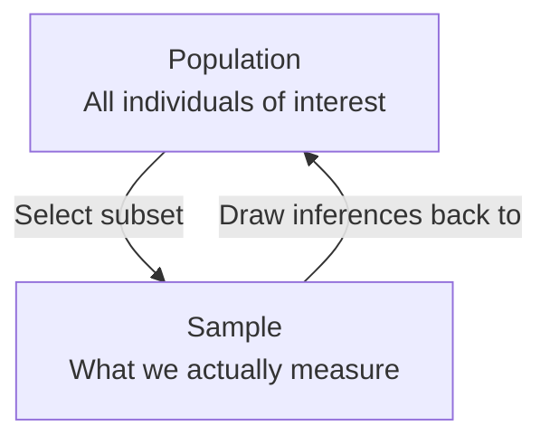
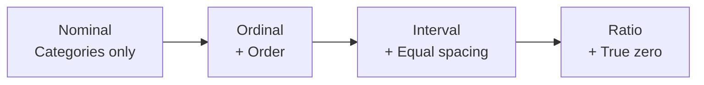

# Introduction to Statistics

Statistics is the science of making sense of data. The world is messy — measurements vary, experiments have noise, and we can never observe everything. Statistics gives us the tools to **describe what we see**, **draw conclusions about what we cannot see**, and **make decisions under uncertainty**.

For engineers and physical scientists, statistics is not optional. When you measure a material's strength, test an electronic component's lifespan, or analyse the output of a chemical reaction, you are not dealing with exact values — you are dealing with data that varies. Statistics is how you extract truth from that variation.

---

## Variables: What Changes Between Individuals

A **variable** is any characteristic or condition that can take on different values across different individuals, objects, or measurements.

Think of measuring the heights of students in a classroom. "Height" is a variable — it changes from person to person. If you measured the tensile strength of 50 steel rods, "tensile strength" is the variable.

Most research begins with a general question about the **relationship between two variables** for a specific group. For example:
- Does class size (variable 1) affect academic performance (variable 2)?
- Does temperature (variable 1) affect reaction rate (variable 2)?

---

## Population vs Sample

### The Population

The **population** is the entire group of individuals you are interested in studying.

> *Example:* A researcher interested in the academic performance of all third-grade children in Nigeria — that entire group is the population.

Populations are almost always too large to study completely. You cannot measure every steel rod ever produced, test every patient in the country, or survey every voter.

### The Sample

A **sample** is a subset selected from the population to represent it in a study. The goal is to use results from the sample to answer questions about the population.

> *Example:* Instead of testing all steel rods, you test 200 rods selected from a production batch. That 200 is your sample.

This idea — using a small part to understand the whole — is the fundamental engine of statistics.

---

## Types of Variables

Variables come in two fundamental types:

### Discrete Variables
A **discrete variable** consists of indivisible, separate categories — you can count them. There are gaps between possible values.

- Number of students in a class: 25, 26, 27... (you cannot have 25.5 students)
- Number of defective items in a batch: 0, 1, 2, 3...
- Number of children in a family

### Continuous Variables
A **continuous variable** can take on any value within a range — infinitely divisible. There are no gaps.

- Temperature: 25.0°C, 25.01°C, 25.001°C...
- Time, weight, length, voltage, pressure
- Speed of a car

### Real Limits
For continuous variables, we use **real limits** to define measurement boundaries. Real limits are located exactly halfway between adjacent categories.

> If you measure time to the nearest second, the value "5 seconds" actually represents any time from 4.5 to 5.5 seconds. The real limits are 4.5 and 5.5.

---

## The Four Scales of Measurement

How you measure a variable determines what you can do with it mathematically. There are four scales, from weakest to strongest:

### 1. Nominal Scale
An **unordered** set of categories identified only by name. You can only determine whether two individuals are the **same or different**.

- Examples: Gender (male/female), Blood type (A, B, AB, O), Course code (STA, PHY, CHE)
- You **cannot** say one category is greater than another
- Mathematics allowed: counting, frequency

### 2. Ordinal Scale
An **ordered** set of categories. You can determine **direction of difference** (greater/less than) but not magnitude.

- Examples: First/Second/Third place in a race; Grade: A, B, C, D, F; Satisfaction: Very Poor, Poor, Good, Excellent
- You know A > B > C but you do not know *how much* greater
- Mathematics allowed: ranking, median

### 3. Interval Scale
An ordered scale with **equal-sized intervals**. You can determine both direction and magnitude of difference. However, **zero is arbitrary** — it does not mean "none."

- Examples: Temperature in °C or °F (0°C does not mean "no temperature"), Calendar years (Year 0 is arbitrary)
- You can say 20°C is 10 degrees more than 10°C, but you **cannot** say 20°C is "twice as hot" as 10°C
- Mathematics allowed: addition, subtraction, mean

### 4. Ratio Scale
An interval scale with a **true, meaningful zero** — zero means complete absence of the variable.

- Examples: Weight (0 kg = no mass), Length, Time duration, Temperature in Kelvin (0 K = no molecular motion), Voltage
- You can make ratio comparisons: 60 kg is **twice** 30 kg
- Mathematics allowed: all operations including ratios

> **Real-world analogy:** Think of measurement scales like a ruler getting more powerful. A nominal scale is like colouring items in different colours: you only know "same" or "different." An ordinal scale adds order: you know which is bigger. An interval scale adds equal spacing: you can measure differences. A ratio scale adds a true zero: you can now compute ratios.

---

## Types of Research Studies

### Correlational Studies
The goal is to determine whether a **relationship exists** between two variables, and to describe that relationship.

A correlational study simply observes the two variables as they naturally exist — no manipulation occurs.

> *Example:* Do taller people tend to have higher salaries? A researcher collects height and salary data from 500 people without manipulating anything.

**Key limitation:** Correlation does not prove causation. A relationship may exist without one variable causing the other.

### Experimental Studies
The goal is to demonstrate a **cause-and-effect relationship**.

In an experiment:
- One variable is deliberately manipulated (the **independent variable**, IV)
- Another variable is observed and measured (the **dependent variable**, DV)
- All other variables are **controlled** to prevent them from influencing results

> *Example:* Does temperature affect the tensile strength of a polymer? You deliberately set the oven to 50°C, 75°C, and 100°C (IV = temperature) and measure the resulting tensile strength (DV = strength). All other factors — humidity, pressure, polymer batch — are held constant.

### Non-experimental / Quasi-experimental Studies
These compare groups of scores (like experiments) but **do not manipulate** a variable. Instead, groups differ on a pre-existing characteristic (e.g., male vs. female, smoker vs. non-smoker).

Because there is no manipulation and control, **cause and effect cannot be demonstrated**. They can only describe relationships — similar to correlational studies.

---

## Data, Parameters, and Statistics

**Data** are the measurements obtained in a research study. The goal of statistics is to help researchers organise and interpret data.

| Term | Definition | Symbol (Typical) |
|------|------------|-----------------|
| **Parameter** | A numerical summary describing a **population** | $\mu$ (mean), $\sigma$ (standard deviation) |
| **Statistic** | A numerical summary describing a **sample** | $\bar{x}$ (mean), $s$ (standard deviation) |

### Descriptive Statistics
Methods for **organising and summarising** data. Tables, graphs, the average score: these are all descriptive.

### Inferential Statistics
Methods for using **sample data to draw conclusions about a population**. Because a sample is only part of the whole, sample statistics are imperfect estimates of population parameters.

### Sampling Error
The **discrepancy between a sample statistic and its population parameter** is called sampling error.

$$\text{Sampling Error} = \text{Sample Statistic} - \text{Population Parameter}$$

Sampling error is not a mistake — it is the natural, unavoidable result of measuring only part of the population. Measuring and managing sampling error is a major part of inferential statistics.

> *Analogy:* Imagine tasting a spoonful of soup to judge the whole pot. Your spoonful (sample) may be slightly saltier or blander than the actual pot (population). That difference is the sampling error. The solution is to stir well (random sampling) and take multiple tastes (larger sample).

---

## Statistical Notation

Before doing any calculations, you must be fluent with standard notation.

| Symbol | Meaning |
|--------|---------|
| $X$ | An individual score or measurement |
| $N$ | Number of scores in a **population** |
| $n$ | Number of scores in a **sample** |
| $\Sigma$ (Sigma) | "The sum of" |
| $\Sigma X$ | The sum of all scores |
| $\Sigma X^2$ | The sum of all scores squared |
| $(\Sigma X)^2$ | The square of the sum of all scores |

> **Important:** $\Sigma X^2 \neq (\Sigma X)^2$. The first squares each value then sums; the second sums all values then squares.

### Worked Example 1: Notation Practice

Given data: $X = \{1, 3, 5, 7\}$

**Find $\Sigma X$:**
$$\Sigma X = 1 + 3 + 5 + 7 = 16$$

**Find $\Sigma X^2$:**
$$\Sigma X^2 = 1^2 + 3^2 + 5^2 + 7^2 = 1 + 9 + 25 + 49 = 84$$

**Find $(\Sigma X)^2$:**
$$(\Sigma X)^2 = (16)^2 = 256$$

Notice: $84 \neq 256$ — the order of operations matters critically.

### Worked Example 2: Population vs Sample

A factory has 8 temperature sensors. Their daily drift values (in ppm) are the full population: $\{1, 2, 2, 3, 3, 4, 5, 6\}$.

**Population mean:**
$$\mu = \frac{\Sigma X}{N} = \frac{1+2+2+3+3+4+5+6}{8} = \frac{26}{8} = 3.25 \text{ ppm}$$

A technician randomly samples 4 sensors: $\{2, 3, 4, 6\}$.

**Sample mean:**
$$\bar{x} = \frac{\Sigma X}{n} = \frac{2+3+4+6}{4} = \frac{15}{4} = 3.75 \text{ ppm}$$

**Sampling error** = $\bar{x} - \mu = 3.75 - 3.25 = 0.50$ ppm.

The sample overestimates the population mean by 0.5 ppm. This is sampling error — it happened because the sample happened to miss the lower values.

---

> **Key Takeaways**
>
> - Statistics is the science of learning from data in the presence of variation and uncertainty
> - A **population** is the full group; a **sample** is the subset we actually measure. We use samples because populations are usually too large to study completely
> - Variables are **discrete** (countable, gapped) or **continuous** (infinitely divisible)
> - The four **measurement scales** — Nominal, Ordinal, Interval, Ratio — determine what mathematical operations are valid on your data
> - **Descriptive statistics** summarise data; **Inferential statistics** use sample data to draw conclusions about populations
> - **Sampling error** is the natural difference between a sample statistic and the true population parameter — it is unavoidable but manageable

---

> **Exam Tips**
>
> - **Scale identification MCQs** are very common. Memorise the NOIR acronym: Nominal → Ordinal → Interval → Ratio. The key question for interval vs ratio is: "Does zero mean absence?" Temperature in °C has an arbitrary zero (interval). Temperature in Kelvin has a true zero (ratio).
> - **Population vs sample symbols**: Population uses Greek letters ($\mu$, $\sigma$, $N$); Sample uses Latin letters ($\bar{x}$, $s$, $n$). Mixing these up in calculations costs marks.
> - **$\Sigma X^2$ vs $(\Sigma X)^2$**: In exam questions involving variance, you will almost certainly compute both. Get the order of operations right — square first, then sum for $\Sigma X^2$; sum first, then square for $(\Sigma X)^2$.
> - The distinction between **descriptive** and **inferential** statistics is a common definition question. Descriptive = organise/summarise the data you have. Inferential = make conclusions about the population from a sample.
> - For **experimental vs correlational study** identification: the keyword is *manipulation*. If the researcher actively changed a variable, it is experimental. If they just observed, it is correlational.
