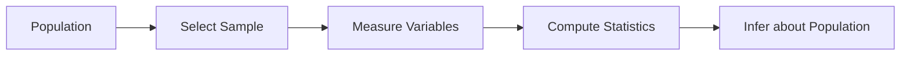

Statistics is the toolbox we use when reality is messy. In engineering and physical science, measurements vary because of instrument limits, environment, and chance. Statistics helps us **describe that variation** and **make decisions under uncertainty**.

## Core ideas

- **Population**: the full group of interest.
- **Sample**: a subset we actually measure.
- **Variable**: what changes (temperature, pressure, class size).
- **Parameter**: a numerical summary of a population (e.g. \(\mu\)).
- **Statistic**: a numerical summary of a sample (e.g. \(\bar{x}\)).
- **Sampling error**: \(\text{error} = \text{statistic} - \text{parameter}\).

### Measurement scales

- **Nominal**: labels only.
- **Ordinal**: ordered labels.
- **Interval**: equal differences, arbitrary zero.
- **Ratio**: equal differences + true zero.

## Formula language

Sample mean:
\[
\bar{x} = \frac{1}{n}\sum_{i=1}^{n} x_i
\]
Where \(n\) is sample size and \(x_i\) is the \(i\)-th observation.

Population mean:
\[
\mu = \frac{1}{N}\sum_{i=1}^{N} X_i
\]

## Worked Example 1: population vs sample

A factory has 8 sensors with true daily drift values (ppm):
\(\{1,2,2,3,3,4,5,6\}\).

- Population mean:
\[
\mu = \frac{1+2+2+3+3+4+5+6}{8} = \frac{26}{8}=3.25
\]

Now sample 4 sensors: \(\{2,3,4,6\}\).

- Sample mean:
\[
\bar{x} = \frac{2+3+4+6}{4}=\frac{15}{4}=3.75
\]

Sampling error:
\[
\bar{x}-\mu=3.75-3.25=0.50
\]

## Worked Example 2: identifying scales

1. Material type (steel, aluminum, copper) \(\to\) **nominal**.
2. Corrosion rating (poor, fair, good, excellent) \(\to\) **ordinal**.
3. Temperature in \(^\circ\mathrm{C}\) \(\to\) **interval**.
4. Mass in kg \(\to\) **ratio**.

## Visual (mermaid): study flow

## Real-world analogy

Think of tasting soup. The whole pot is the population; one spoon is the sample. A good spoon gives a good estimate, but it is still an estimate.

> **Key Takeaway**
> Statistics is about variation, evidence, and decision-making. Always separate population ideas (parameters) from sample ideas (statistics).

> **Exam Tips**
> - Lecturers love definitions: population, sample, parameter, statistic.
> - Expect classification questions on measurement scales.
> - Common mistake: treating sample values as if they are exact population truths.
> - Memorize symbols: \(\mu,\sigma,N\) for population; \(\bar{x},s,n\) for sample.
