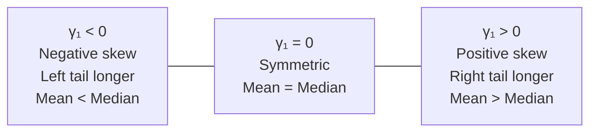

# Moments and Chebyshev's Theorem

The mean tells you where a distribution is centred. The variance tells you how spread out it is. But two distributions can have exactly the same mean and variance while looking completely different — one might be perfectly symmetric, another might lean heavily to the right; one might be sharply peaked, another almost flat. **Moments** are the complete family of descriptive measures that capture all of these features systematically.

The idea borrows from physics. In mechanics, the "moment" of a mass distribution describes how mass is arranged relative to a pivot point. The first moment gives the centre of mass. The second moment describes how mass is spread around that centre. The third moment describes tilt. The fourth describes how much mass is concentrated at the extremes. In probability, the same mathematics applies — replace "mass" with "probability."

**Chebyshev's theorem** adds something remarkable on top of all this: regardless of the shape of any distribution at all, it guarantees a precise minimum fraction of observations within $k$ standard deviations of the mean.

---

## Raw Moments (Moments About the Origin)

The **$r$-th raw moment** of $X$ is the expected value of $X^r$. The term "about the origin" means we raise $X$ to a power without subtracting the mean first.

For **discrete** $X$:
$$\mu'_r = E(X^r) = \sum_{\text{all } x} x^r \, f(x)$$

For **continuous** $X$:
$$\mu'_r = E(X^r) = \int_{-\infty}^{\infty} x^r \, f(x) \, dx$$

| Raw moment | Notation | What it equals |
|-----------|----------|----------------|
| First | $\mu'_1$ | $E(X) = \mu$ (the mean) |
| Second | $\mu'_2$ | $E(X^2)$ — used to compute variance |
| Third | $\mu'_3$ | $E(X^3)$ — used to derive skewness |
| Fourth | $\mu'_4$ | $E(X^4)$ — used to derive kurtosis |

---

## Central Moments (Moments About the Mean)

The **$r$-th central moment** measures the expected value of $(X - \mu)^r$. We measure from the mean this time, not from the origin.

For **discrete** $X$:
$$\mu_r = E\!\left[(X - \mu)^r\right] = \sum_{\text{all } x} (x - \mu)^r \, f(x)$$

For **continuous** $X$:
$$\mu_r = E\!\left[(X - \mu)^r\right] = \int_{-\infty}^{\infty} (x - \mu)^r \, f(x) \, dx$$

The first four central moments each describe something specific about the shape:

- $\mu_1 = 0$: always zero — positive and negative deviations from the mean cancel exactly
- $\mu_2 = \sigma^2$: the variance — how spread the distribution is around its mean
- $\mu_3$: measures **skewness** — whether the distribution leans left or right
- $\mu_4$: measures **kurtosis** — how heavy or light the tails are compared to normal

---

## Converting Raw Moments to Central Moments

Computing central moments directly requires integrating $(x - \mu)^r f(x)$, which is messy. The standard method is to compute raw moments first, then use these conversion formulas (derived by expanding $(X - \mu'_1)^r$ with the binomial theorem):

$$\mu_1 = 0$$

$$\mu_2 = \mu'_2 - (\mu'_1)^2$$

$$\mu_3 = \mu'_3 - 3\mu'_2 \mu'_1 + 2(\mu'_1)^3$$

$$\mu_4 = \mu'_4 - 4\mu'_3 \mu'_1 + 6\mu'_2 (\mu'_1)^2 - 3(\mu'_1)^4$$

The pattern of coefficients (1, 3, 2 for $\mu_3$; 1, 4, 6, 3 for $\mu_4$) comes from Pascal's triangle with alternating signs.

---

## Worked Example 1: All Four Moments for a Continuous Distribution

A continuous random variable $X$ has PDF:

$$f(x) = \frac{3}{4}x(2-x), \quad 0 < x < 2$$

**Verify the PDF is valid:**
$$\frac{3}{4}\int_0^2 x(2-x)\, dx = \frac{3}{4}\left[x^2 - \frac{x^3}{3}\right]_0^2 = \frac{3}{4}\left(4 - \frac{8}{3}\right) = \frac{3}{4} \times \frac{4}{3} = 1 \checkmark$$

**Step 1: Compute the four raw moments**

$$\mu'_1 = \frac{3}{4}\int_0^2 x^2(2-x)\, dx = \frac{3}{4}\left[\frac{2x^3}{3} - \frac{x^4}{4}\right]_0^2 = \frac{3}{4}\left(\frac{16}{3} - 4\right) = \frac{3}{4} \times \frac{4}{3} = 1$$

$$\mu'_2 = \frac{3}{4}\int_0^2 x^3(2-x)\, dx = \frac{3}{4}\left[\frac{x^4}{2} - \frac{x^5}{5}\right]_0^2 = \frac{3}{4}\left(8 - \frac{32}{5}\right) = \frac{3}{4} \times \frac{8}{5} = \frac{6}{5}$$

$$\mu'_3 = \frac{3}{4}\int_0^2 x^4(2-x)\, dx = \frac{3}{4}\left[\frac{2x^5}{5} - \frac{x^6}{6}\right]_0^2 = \frac{3}{4}\left(\frac{64}{5} - \frac{64}{6}\right) = \frac{3}{4} \times \frac{64}{30} = \frac{8}{5}$$

$$\mu'_4 = \frac{3}{4}\int_0^2 x^5(2-x)\, dx = \frac{3}{4}\left[\frac{x^6}{3} - \frac{x^7}{7}\right]_0^2 = \frac{3}{4}\left(\frac{64}{3} - \frac{128}{7}\right) = \frac{3}{4} \times \frac{64}{21} = \frac{16}{7}$$

**Step 2: Convert to central moments**

$$\mu_1 = 0$$

$$\mu_2 = \mu'_2 - (\mu'_1)^2 = \frac{6}{5} - 1 = \frac{1}{5}$$

$$\mu_3 = \mu'_3 - 3\mu'_2\mu'_1 + 2(\mu'_1)^3 = \frac{8}{5} - 3\left(\frac{6}{5}\right)(1) + 2(1) = \frac{8-18+10}{5} = 0$$

$$\mu_4 = \mu'_4 - 4\mu'_3\mu'_1 + 6\mu'_2(\mu'_1)^2 - 3(\mu'_1)^4 = \frac{16}{7} - 4\left(\frac{8}{5}\right) + 6\left(\frac{6}{5}\right) - 3 = \frac{16}{7} + \frac{4}{5} - 3 = \frac{80 + 28 - 105}{35} = \frac{3}{35}$$

$\mu_3 = 0$ is expected: the PDF $\frac{3}{4}x(2-x)$ is a parabola symmetric about $x = 1 = \mu$, so the distribution has no skew.

---

## Worked Example 2: All Four Moments for a Discrete Distribution

A discrete random variable $X$ has PMF:

| $x$ | $-1$ | $0$ | $1$ |
|-----|------|-----|-----|
| $f(x)$ | $1/4$ | $1/2$ | $1/4$ |

**Raw moments:**

$$\mu'_1 = (-1)(1/4) + (0)(1/2) + (1)(1/4) = 0$$

$$\mu'_2 = (1)(1/4) + (0)(1/2) + (1)(1/4) = \frac{1}{2}$$

$$\mu'_3 = (-1)(1/4) + 0 + (1)(1/4) = 0$$

$$\mu'_4 = (1)(1/4) + 0 + (1)(1/4) = \frac{1}{2}$$

Since $\mu = \mu'_1 = 0$, the central moments are the same as the raw moments here:

$$\mu_1 = 0, \quad \mu_2 = \frac{1}{2}, \quad \mu_3 = 0, \quad \mu_4 = \frac{1}{2}$$

The distribution is symmetric about zero, so all odd central moments are zero.

---

## Worked Example 3: Converting Raw to Central Moments

Given: $\mu'_1 = 2$, $\mu'_2 = 5$, $\mu'_3 = 14$, $\mu'_4 = 46$. Find all four central moments.

$$\mu_1 = 0$$

$$\mu_2 = 5 - (2)^2 = 1 \quad \Rightarrow \quad \sigma = 1$$

$$\mu_3 = 14 - 3(5)(2) + 2(2)^3 = 14 - 30 + 16 = 0$$

$$\mu_4 = 46 - 4(14)(2) + 6(5)(4) - 3(16) = 46 - 112 + 120 - 48 = 6$$

---

## Skewness and Kurtosis

Once you have the central moments, two standardised shape measures follow directly.

### Skewness

Skewness measures whether the distribution leans left or right — whether it has a longer tail on one side.

$$\gamma_1 = \frac{\mu_3}{(\mu_2)^{3/2}} = \frac{\mu_3}{\sigma^3}$$

> **Real-world analogy:** Salary distributions are positively skewed ($\gamma_1 > 0$). Most people earn around the median, but a small number of very high earners create a long right tail. The mean salary gets pulled well above the median because of those outliers — that is positive skew in action.

### Kurtosis

Kurtosis measures how heavy or light the tails are relative to the normal distribution.

$$\beta_2 = \frac{\mu_4}{(\mu_2)^2} = \frac{\mu_4}{\sigma^4}$$

| $\beta_2$ | Name | Meaning |
|-----------|------|---------|
| $= 3$ | Mesokurtic | Normal distribution (the baseline) |
| $> 3$ | Leptokurtic | Sharper peak, heavier tails — more extreme values |
| $< 3$ | Platykurtic | Flatter peak, lighter tails — fewer extreme values |

> **Real-world analogy:** Daily stock market returns are leptokurtic ($\beta_2 > 3$). Compared to a bell curve, there are more ordinary days clustered near zero, but also more sudden crash or surge days in the extreme tails. The normal distribution underestimates the frequency of financial disasters — which is why kurtosis matters in risk management.

---

## Worked Example 4: Computing Skewness and Kurtosis

**Using results from Example 3:** $\mu_2 = 1$ (so $\sigma = 1$), $\mu_3 = 0$, $\mu_4 = 6$.

$$\gamma_1 = \frac{\mu_3}{\sigma^3} = \frac{0}{1} = 0 \quad \text{(perfectly symmetric)}$$

$$\beta_2 = \frac{\mu_4}{\sigma^4} = \frac{6}{1} = 6 \quad \text{(leptokurtic — heavier tails than normal)}$$

**Using results from Example 1:** $\mu_2 = 1/5$ (so $\sigma^2 = 1/5$), $\mu_3 = 0$, $\mu_4 = 3/35$.

$$\gamma_1 = \frac{0}{(1/5)^{3/2}} = 0 \quad \text{(symmetric, as expected)}$$

$$\beta_2 = \frac{3/35}{(1/5)^2} = \frac{3/35}{1/25} = \frac{3 \times 25}{35} = \frac{15}{7} \approx 2.14 \quad \text{(platykurtic)}$$

$\beta_2 \approx 2.14 < 3$ makes physical sense: the distribution is bounded between 0 and 2, so it cannot produce extreme values. It is inherently flatter-tailed than the normal distribution.

---

## Chebyshev's Theorem

Chebyshev's theorem is remarkable: it makes a probabilistic guarantee about **any distribution** without knowing its shape. For any random variable with finite mean $\mu$ and standard deviation $\sigma$:

$$\boxed{P\!\left(\left|X - \mu\right| \geq k\sigma\right) \leq \frac{1}{k^2}}$$

Equivalently:

$$\boxed{P\!\left(\left|X - \mu\right| < k\sigma\right) \geq 1 - \frac{1}{k^2}}$$

In words: the probability that $X$ falls **within $k$ standard deviations of the mean** is at least $1 - \frac{1}{k^2}$, for any $k > 1$.

> **Analogy:** Suppose you know nothing about how exam scores are distributed — not normal, not uniform, not anything specific. Chebyshev's theorem still tells you that at least 75% of students must score within 2 standard deviations of the mean ($1 - 1/4 = 75\%$). It is a floor guarantee, valid for every distribution that has a finite mean and variance.

| $k$ | Guaranteed minimum within $k\sigma$ of mean |
|-----|---------------------------------------------|
| $k = 2$ | $1 - 1/4 = 75\%$ |
| $k = 3$ | $1 - 1/9 \approx 88.9\%$ |
| $k = 4$ | $1 - 1/16 = 93.75\%$ |
| $k = 5$ | $1 - 1/25 = 96\%$ |

Note: these are **lower bounds**. If the distribution is known to be normal, the empirical rule gives tighter bounds (68%, 95%, 99.7% for $k = 1, 2, 3$).

### Worked Example 5: Applying Chebyshev's Theorem

A random variable $X$ has $\mu = 12$ and $\sigma^2 = 9$ (so $\sigma = 3$). Find the lower bound on $P(6 \leq X \leq 18)$.

**Step 1: Express the interval in terms of $k\sigma$.**

The interval $[6, 18]$ is symmetric about $\mu = 12$. The half-width is $18 - 12 = 6$. Since $\sigma = 3$:
$$k\sigma = 6 \implies k = 2$$

**Step 2: Apply Chebyshev's theorem.**

$$P(|X - 12| < 2 \times 3) \geq 1 - \frac{1}{4} = \frac{3}{4}$$

Therefore $P(6 \leq X \leq 18) \geq 0.75$. At least 75% of values lie in this interval.

### Worked Example 6: Finding $k$ from an Interval

A random variable has $\mu = 50$ and $\sigma^2 = 25$ (so $\sigma = 5$). Find the minimum probability that $X$ lies between 35 and 65.

The half-width is $65 - 50 = 15$. So $k\sigma = 15 \implies k = 15/5 = 3$.

$$P(35 \leq X \leq 65) \geq 1 - \frac{1}{9} = \frac{8}{9} \approx 0.889$$

At least 88.9% of values fall in this interval.

---

> **Key Takeaways**
>
> - **Raw moments** $\mu'_r = E(X^r)$: compute these first; $\mu'_1$ is the mean, $\mu'_2$ feeds into variance
> - **Central moments** $\mu_r = E[(X-\mu)^r]$: $\mu_1 = 0$ always; $\mu_2 = \sigma^2$; $\mu_3$ is skewness-related; $\mu_4$ is kurtosis-related
> - **Conversion**: use the four formulas to convert raw → central (faster than computing central moments directly)
> - **Skewness** $\gamma_1 = \mu_3/\sigma^3$: zero = symmetric; positive = right tail longer; negative = left tail longer
> - **Kurtosis** $\beta_2 = \mu_4/\sigma^4$: 3 = normal (reference); above 3 = leptokurtic (heavy tails); below 3 = platykurtic (light tails)
> - **Chebyshev's theorem**: $P(|X - \mu| < k\sigma) \geq 1 - 1/k^2$ — valid for any distribution with finite mean and variance

---

> **Exam Tips**
>
> - **The standard exam question** is: "Find the first four moments about the origin, and hence the first four moments about the mean." Always do raw moments first, then convert — never attempt central moments from scratch by integrating $(x - \mu)^r f(x)$.
> - **The $\mu_3$ and $\mu_4$ conversion formulas are memorisable** if you notice the pattern: coefficients 1, 3, 2 for $\mu_3$; and 1, 4, 6, 3 for $\mu_4$ with alternating signs. These are binomial coefficients.
> - **Skewness and kurtosis follow from the central moments** — they are just standardised versions. Once you have $\mu_2$, $\mu_3$, $\mu_4$, computing $\gamma_1$ and $\beta_2$ is one more step.
> - **For Chebyshev questions**, the setup is always the same: find the half-width of the interval, divide by $\sigma$ to get $k$, then compute $1 - 1/k^2$. The trap is forgetting to check that the interval is symmetric about $\mu$ — if it is not, Chebyshev applies to the shorter half-width.
> - **Chebyshev gives a lower bound, not the exact probability.** If the question asks "using Chebyshev, find a lower bound for..." then $1 - 1/k^2$ is your answer. If it asks "find the exact probability..." you need the actual distribution — Chebyshev cannot give that.
> - A common "show that" question: derive $\mu_3 = \mu'_3 - 3\mu'_2\mu'_1 + 2(\mu'_1)^3$ by expanding $E[(X - \mu'_1)^3]$ using the binomial theorem and applying linearity of expectation.
