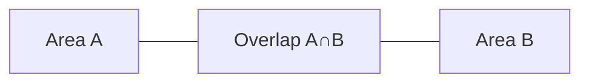

Probability quantifies uncertainty between 0 and 1. In practical terms, it tells you how likely an event is when outcomes vary.

## Definitions

- Sample space: \(S\)
- Event: \(A \subseteq S\)
- Probability: \(0\le P(A)\le 1\)

Rules:
\[
P(S)=1,\quad P(A^c)=1-P(A)
\]
\[
P(A\cup B)=P(A)+P(B)-P(A\cap B)
\]
If \(A,B\) are mutually exclusive, then \(P(A\cap B)=0\), so
\[
P(A\cup B)=P(A)+P(B)
\]

## Worked Example 1: additive rule

Given \(P(A)=0.55\), \(P(B)=0.40\), \(P(A\cap B)=0.20\):
\[
P(A\cup B)=0.55+0.40-0.20=0.75
\]

## Worked Example 2: complement rule

Probability machine fails in a day is 0.08. Probability it does **not** fail:
\[
P(F^c)=1-P(F)=1-0.08=0.92
\]

## Visual: Venn logic

## Analogy

Think umbrellas: probability of rain is how strongly you should prepare, not a guarantee of what must happen.

> **Key Takeaway**
> Use complement, union, and intersection correctly; most probability questions are just these rules in disguise.

> **Exam Tips**
> - Distinguish \(A\cup B\) (OR) from \(A\cap B\) (AND).
> - In MCQ, check for double counting when adding probabilities.
> - Always sanity-check that final probability is between 0 and 1.
