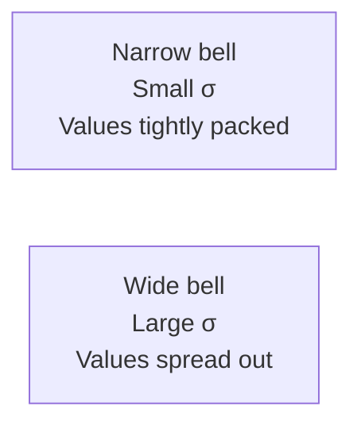
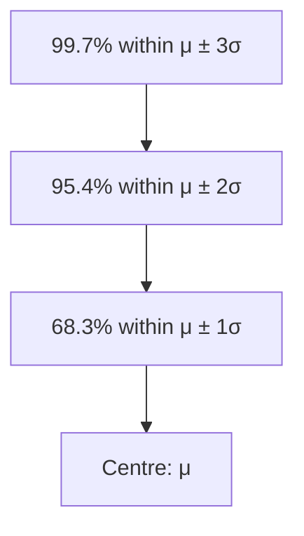

# The Normal Distribution

If there is one distribution that dominates statistics, it is the normal distribution — the famous **bell curve**. It appears naturally everywhere: heights of people, measurement errors, exam scores, manufacturing tolerances. The central limit theorem (discussed below) gives an even deeper reason: the average of almost any random quantity, when computed from large samples, tends toward a normal distribution.

Understanding the normal distribution is the gateway to nearly all of classical inferential statistics.

---

## The Normal Distribution: Shape and Properties

A random variable $X$ follows a **normal distribution** with mean $\mu$ and variance $\sigma^2$, written $X \sim N(\mu, \sigma^2)$, if its PDF is:

$$f(x) = \frac{1}{\sigma\sqrt{2\pi}} \exp\left(-\frac{(x-\mu)^2}{2\sigma^2}\right), \quad -\infty < x < \infty$$

Where:
- $\mu$ = mean (location — determines where the bell is centred)
- $\sigma$ = standard deviation (scale — determines how wide or narrow the bell is)
- $\sigma^2$ = variance
- $e \approx 2.71828$, $\pi \approx 3.14159$

### Key Properties of the Normal Distribution

1. **Symmetric** about the mean $\mu$ — the bell curve is a perfect mirror image on both sides
2. **Mean = Median = Mode** — all three are equal and sit exactly at the centre
3. **Bell-shaped** — highest in the centre, tapering off on both sides, never reaching zero
4. **Asymptotic** — the tails extend to $\pm\infty$ but never actually touch the x-axis
5. **Total area = 1** (as with any valid PDF)

> **Analogy:** Imagine measuring the weight of 10,000 people. Most cluster around the average weight, fewer are very light or very heavy. The distribution of weights looks like a bell — tall in the middle where most people are, sloping down at the extremes. That's the normal distribution in action.

---

## The Standard Normal Distribution

Working with any particular $N(\mu, \sigma^2)$ distribution would require unique tables for every possible $\mu$ and $\sigma$. Instead, we **standardise** — convert any normal distribution to the **standard normal** $N(0,1)$, which has mean 0 and variance 1.

### The Standardisation Formula (Z-score)

$$\boxed{Z = \frac{X - \mu}{\sigma}}$$

If $X \sim N(\mu, \sigma^2)$, then $Z \sim N(0, 1)$.

**Interpretation of the Z-score:** $Z$ tells you how many standard deviations $X$ is above or below the mean.
- $Z = 2$ means $X$ is 2 standard deviations above average
- $Z = -1.5$ means $X$ is 1.5 standard deviations below average

The standard normal PDF is:
$$\phi(z) = \frac{1}{\sqrt{2\pi}} e^{-z^2/2}$$

Probabilities are read from **standard normal tables** (Z-tables), which give $\Phi(z) = P(Z \leq z)$.

---

## The Empirical Rule (68-95-99.7 Rule)

For any normal distribution $N(\mu, \sigma^2)$:

| Interval | Probability |
|----------|-------------|
| $\mu \pm 1\sigma$ | approximately **68.3%** |
| $\mu \pm 2\sigma$ | approximately **95.4%** |
| $\mu \pm 3\sigma$ | approximately **99.7%** |

> **This is the "empirical rule"** — the backbone of quality control, where anything beyond $\pm 3\sigma$ is considered an anomaly ("3-sigma rule").

---

## Reading Probabilities from the Normal Distribution

To find probabilities, we convert $X$ values to $Z$ scores and use tables.

### Key Relationships Using Z-tables

Let $\Phi(z)$ denote the CDF of the standard normal: $\Phi(z) = P(Z \leq z)$.

- $P(Z \leq z) = \Phi(z)$ — read directly from table
- $P(Z \geq z) = 1 - \Phi(z)$ — complement
- $P(a \leq Z \leq b) = \Phi(b) - \Phi(a)$ — difference of CDF values
- $P(Z \leq -z) = 1 - \Phi(z)$ — symmetry of the standard normal

### Worked Example 1: Finding Probabilities

IQ scores follow $N(100, 225)$ (mean 100, variance 225, so $\sigma = 15$).

**(a) What percentage of people have IQ above 130?**

$$Z = \frac{130 - 100}{15} = \frac{30}{15} = 2$$

$P(X > 130) = P(Z > 2) = 1 - \Phi(2) = 1 - 0.9772 = 0.0228$

About **2.28%** of people have IQ above 130.

**(b) What percentage have IQ between 85 and 115?**

$$Z_1 = \frac{85 - 100}{15} = -1, \quad Z_2 = \frac{115 - 100}{15} = 1$$

$P(85 \leq X \leq 115) = P(-1 \leq Z \leq 1) = \Phi(1) - \Phi(-1) = 0.8413 - 0.1587 = 0.6826$

About **68.3%** — consistent with the empirical rule.

### Worked Example 2: Finding an X Value from a Probability

Exam scores follow $N(65, 100)$ (mean 65, SD 10). What score corresponds to the 90th percentile?

**We want** $x$ such that $P(X \leq x) = 0.90$.

**Step 1:** From Z-tables, $\Phi(z) = 0.90 \implies z = 1.282$ (the 90th percentile of the standard normal).

**Step 2:** Convert back to $X$:
$$x = \mu + z\sigma = 65 + (1.282)(10) = 65 + 12.82 = 77.82$$

A score of about **77.8** is needed to be in the top 10%.

---

## Sampling and the Central Limit Theorem

### Sampling Distribution of the Mean

When you take many random samples of size $n$ from a population and compute each sample's mean $\bar{x}$, those sample means form their own distribution — the **sampling distribution of the mean**.

Key results:
- **Mean of sample means:** $E(\bar{x}) = \mu$ (sample means are centred at the population mean)
- **Variance of sample means:** $Var(\bar{x}) = \frac{\sigma^2}{n}$
- **Standard error:** $SE = \frac{\sigma}{\sqrt{n}}$ (standard deviation of the sampling distribution)

The larger the sample size $n$, the smaller the standard error — larger samples give more precise estimates of the true mean.

### The Central Limit Theorem (CLT)

The CLT is arguably the most important theorem in statistics:

> **If $X_1, X_2, \ldots, X_n$ are independent and identically distributed random variables with mean $\mu$ and variance $\sigma^2$, then as $n \to \infty$:**
>
> $$\bar{X} = \frac{X_1 + X_2 + \cdots + X_n}{n} \xrightarrow{\text{distribution}} N\left(\mu, \frac{\sigma^2}{n}\right)$$

**In practice:** For $n \geq 30$, the sampling distribution of $\bar{X}$ is approximately normal, regardless of the original population's distribution.

> **Analogy:** Roll a single die — the result is uniformly distributed across $\{1, 2, 3, 4, 5, 6\}$. Now roll 30 dice and compute the average. Do this millions of times. The distribution of those averages will look bell-shaped, even though individual die rolls are uniform. That's the CLT.

### Worked Example 3: CLT Application

A factory produces light bulbs with mean lifespan $\mu = 1200$ hours and standard deviation $\sigma = 200$ hours (distribution unknown). A sample of 100 bulbs is tested.

What is the probability that the sample mean lifespan exceeds 1225 hours?

By the CLT, $\bar{X} \sim N\left(1200, \frac{200^2}{100}\right) = N(1200, 400)$, so $SE = 20$.

$$Z = \frac{\bar{x} - \mu}{SE} = \frac{1225 - 1200}{20} = \frac{25}{20} = 1.25$$

$P(\bar{X} > 1225) = P(Z > 1.25) = 1 - \Phi(1.25) = 1 - 0.8944 = 0.1056$

There is about a **10.6%** chance the sample mean exceeds 1225 hours.

---

## Normal Approximation to the Binomial

When $n$ is large and $p$ is not too close to 0 or 1, the binomial distribution can be approximated by a normal distribution:

If $X \sim B(n, p)$, then for large $n$:
$$X \approx N(np, np(1-p))$$

**Rule of thumb for when this is valid:** $np \geq 5$ and $n(1-p) \geq 5$.

### Continuity Correction

Since we are approximating a discrete distribution (binomial) with a continuous one (normal), we apply a **continuity correction**: to find $P(X = k)$ for the binomial, use $P(k - 0.5 \leq X \leq k + 0.5)$ for the normal.

### Worked Example 4: Normal Approximation to Binomial

A fair coin is tossed 200 times. Use the normal approximation to find $P(X \geq 110)$ where $X$ = number of heads.

$n = 200$, $p = 0.5$, so $\mu = np = 100$, $\sigma^2 = np(1-p) = 50$, $\sigma = \sqrt{50} \approx 7.07$.

Check: $np = 100 \geq 5$ ✓, $n(1-p) = 100 \geq 5$ ✓

With continuity correction: $P(X \geq 110) \approx P\left(Z \geq \frac{109.5 - 100}{7.07}\right) = P(Z \geq 1.343) = 1 - 0.9104 = 0.0896$

---

> **Key Takeaways**
>
> - The normal distribution $N(\mu, \sigma^2)$ is symmetric, bell-shaped, and characterised entirely by its mean and variance
> - Standardise with $Z = (X - \mu)/\sigma$ to convert any normal probability to a standard normal problem
> - The empirical rule: 68% within $\pm 1\sigma$, 95% within $\pm 2\sigma$, 99.7% within $\pm 3\sigma$
> - The **Central Limit Theorem**: for large $n$, the sampling distribution of $\bar{X}$ is approximately $N(\mu, \sigma^2/n)$, regardless of the original distribution
> - Standard error $= \sigma/\sqrt{n}$ — increases sample size, reduces uncertainty

---

> **Exam Tips**
>
> - When computing normal probabilities: (1) draw a sketch of the curve and shade the region, (2) convert to Z-scores, (3) use the Z-table, (4) handle the direction (greater than vs less than) using $1 - \Phi(z)$ or the symmetry property.
> - **Symmetry property of the standard normal:** $P(Z \leq -z) = P(Z \geq z) = 1 - \Phi(z)$. If your table only gives $P(Z \leq z)$ for positive $z$, use this.
> - For "between" problems: $P(a \leq X \leq b) = P(Z_a \leq Z \leq Z_b) = \Phi(Z_b) - \Phi(Z_a)$.
> - **Don't forget to divide by $\sqrt{n}$ for sampling distribution questions.** The standard error is $\sigma/\sqrt{n}$, not $\sigma$.
> - The formula $Z = (\bar{X} - \mu)/(\sigma/\sqrt{n})$ is used for sample mean problems; $Z = (X - \mu)/\sigma$ is for individual value problems.
